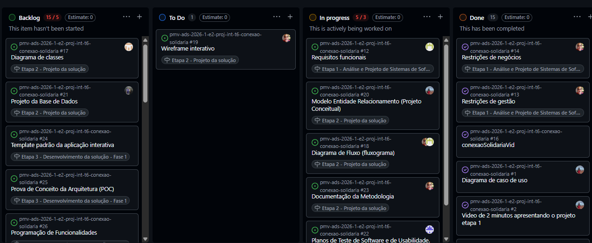
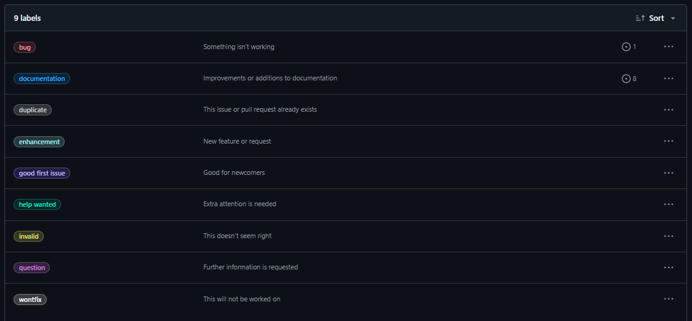

## Metodologia

A equipe adota a metodologia ágil **Scrum** como base para o processo de desenvolvimento,
complementada por práticas do **Kanban** para visualização e controle do fluxo de trabalho.
As entregas são organizadas em sprints, com reuniões periódicas de alinhamento e revisão
de progresso entre os membros da equipe.

---

## Relação de Ambientes de Trabalho

Os artefatos do projeto são desenvolvidos a partir de diversas plataformas. A relação
dos ambientes de trabalho utilizados é apresentada na tabela abaixo.

| Ambiente | Plataforma | Link de Acesso |
|---|---|---|
| Repositório de Código Fonte | GitHub | [Repositório GitHub](https://github.com/ICEI-PUC-Minas-PMV-ADS/pmv-ads-2026-1-e2-proj-int-t6-conexao-solidaria) |
| Documentação do Projeto | GitHub | [Documentação](https://github.com/ICEI-PUC-Minas-PMV-ADS/pmv-ads-2026-1-e2-proj-int-t6-conexao-solidaria/tree/main/docs) |
| Gerenciamento do Projeto | GitHub Projects | [Kanban – Conexão Solidária](https://github.com/ICEI-PUC-Minas-PMV-ADS/pmv-ads-2026-1-e2-proj-int-t6-conexao-solidaria/projects) |
| Projeto de Interface e Wireframes | Figma | [Figma – Conexão Solidária](https://www.figma.com/files/team/1154192834884904915/project/67606031?fuid=1154192825316097448) |
| Comunicação da Equipe | Microsoft Teams / WhatsApp | - |
| Hospedagem da Aplicação | A definir | - |

---

## Controle de Versão

A ferramenta de controle de versão adotada no projeto é o [Git](https://git-scm.com/),
sendo que o [GitHub](https://github.com) é utilizado para a hospedagem do repositório.

O projeto segue a seguinte convenção para o nome de branches:

- `main`: versão estável já testada do software
- `develop`: versão de desenvolvimento do software
- `feature/nome-da-feature`: implementação de nova funcionalidade
- `bugfix/nome-do-bug`: correção de problemas identificados

Quanto à gerência de issues, o projeto adota a seguinte convenção para
etiquetas (labels):

- `bug`: indica que algo não está funcionando corretamente
- `documentation`: melhorias ou acréscimos à documentação
- `duplicate`: indica que a issue ou pull request já existe
- `enhancement`: nova funcionalidade ou solicitação de melhoria
- `good first issue`: boa para novos contribuidores do projeto
- `help wanted`: requer atenção especial ou contribuição externa
- `invalid`: indica que a issue não parece correta ou pertinente
- `question`: solicitação de informações adicionais
- `wontfix`: indica que o item não será corrigido ou implementado

---

## Gerenciamento do Projeto

### Divisão de Papéis

A equipe está organizada da seguinte maneira:

- **Scrum Master**: Tiago Pereira do Nascimento
- **Product Owner**: Italo Natan de Oliveira Lopes
- **Equipe de Desenvolvimento e Design**:
  - Arthur Eduardo Andrade Lobo
  - Gustavo Henrique Simão Bruno
  - Luisa Clara de Sousa Lopes
  - Richard Rodrigues de Sousa

### Processo

Para organização e distribuição das tarefas do projeto, a equipe utiliza o
**GitHub Projects**, estruturado com um quadro **Kanban** dividido nas
seguintes colunas:

- **Backlog**: contém todos os itens de trabalho identificados para o projeto
  que ainda não foram iniciados. Representa o registro completo de demandas
  e funcionalidades a serem desenvolvidas.
- **To Do**: representa as tarefas priorizadas e prontas para serem iniciadas
  na sprint atual, aguardando atribuição ou início imediato.
- **In Progress**: tarefas que estão sendo ativamente desenvolvidas no
  momento por algum membro da equipe.
- **Done**: tarefas concluídas, revisadas e validadas conforme os critérios
  de aceitação definidos.

As tarefas são organizadas e distribuídas por etapas do projeto:

- **Etapa 1 – Análise e Projeto de Sistemas de Software**
- **Etapa 2 – Projeto da Solução**
- **Etapa 3 – Desenvolvimento da Solução – Fase 1**

O quadro Kanban pode ser acessado em:
[GitHub Projects – Conexão Solidária](https://github.com/ICEI-PUC-Minas-PMV-ADS/pmv-ads-2026-1-e2-proj-int-t6-conexao-solidaria/projects) e é apresentado, no estado atual, na Figura 3:

<figure>
  
  <figcaption>Figura 3 – Tela do quadro Kanban do GitHub criada pelo grupo.</figcaption>
</figure>

A tarefas são classificadas em função da natureza ou prioridade da atividade e seguem o um esquema de etiquetagem entre cores e categorias que pode ser visto pela Figura 4:

<figure>
  
  <figcaption>Figura 4 – Tela de etiquetas do quadro Kanban no GitHub.</figcaption>
</figure>

### Ferramentas

As ferramentas empregadas no projeto são:

| Ferramenta | Finalidade |
|---|---|
| Git / GitHub | Controle de versão e hospedagem do repositório |
| GitHub Projects | Gerenciamento de tarefas e acompanhamento do progresso (Kanban) |
| Microsoft Teams | Comunicação síncrona e reuniões da equipe |
| WhatsApp | Comunicação rápida e informal entre os membros |
| Figma | Prototipação de interfaces e criação de wireframes |
| Visual Studio Code | Desenvolvimento e edição de código-fonte |

As ferramentas foram escolhidas com base na integração entre si e na familiaridade
da equipe com cada uma delas. O **Git** e o **GitHub** são amplamente reconhecidos
como padrão de mercado para controle de versão e colaboração em código-fonte,
oferecendo rastreabilidade completa das alterações e suporte ao trabalho simultâneo
entre os membros. O **GitHub Projects** foi adotado por estar nativamente integrado
ao repositório, eliminando a necessidade de ferramentas externas para o gerenciamento
das tarefas e permitindo a vinculação direta entre issues, pull requests e o quadro
Kanban.

Já o **Microsoft Teams** e o **WhatsApp** atendem às necessidades de comunicação
da equipe, sendo o Teams utilizado para reuniões estruturadas e o WhatsApp para
trocas rápidas e informais do dia a dia. O **Figma** foi selecionado para a
prototipação por ser uma ferramenta colaborativa baseada em nuvem, que permite
que todos os membros visualizem e comentem os protótipos em tempo real, sem
necessidade de instalação. Por fim, o **Visual Studio Code** se destaca como editor
de código pela sua leveza, extensibilidade e suporte nativo ao Git, tornando o
fluxo de desenvolvimento mais ágil e produtivo.

<!--
# Metodologia

Pré-requisitos: <a href="2-Especificação do Projeto.md"> Documentação de Especificação</a>

Descreva aqui a metodologia de trabalho do grupo para atacar o problema. Definições sobre os ambiente de trabalho utilizados pela  equipe para desenvolver o projeto. Abrange a relação de ambientes utilizados, a estrutura para gestão do código fonte, além da definição do processo e ferramenta através dos quais a equipe se organiza (Gestão de Times).

## Controle de Versão

A ferramenta de controle de versão adotada no projeto foi o
[Git](https://git-scm.com/), sendo que o [Github](https://github.com)
foi utilizado para hospedagem do repositório.

O projeto segue a seguinte convenção para o nome de branches:

- `main`: versão estável já testada do software
- `unstable`: versão já testada do software, porém instável
- `testing`: versão em testes do software
- `dev`: versão de desenvolvimento do software

Quanto à gerência de issues, o projeto adota a seguinte convenção para
etiquetas:

- `documentation`: melhorias ou acréscimos à documentação
- `bug`: uma funcionalidade encontra-se com problemas
- `enhancement`: uma funcionalidade precisa ser melhorada
- `feature`: uma nova funcionalidade precisa ser introduzida

Discuta como a configuração do projeto foi feita na ferramenta de versionamento escolhida. Exponha como a gerência de tags, merges, commits e branchs é realizada. Discuta como a gerência de issues foi realizada.

> **Links Úteis**:
> - [Tutorial GitHub](https://guides.github.com/activities/hello-world/)
> - [Git e Github](https://www.youtube.com/playlist?list=PLHz_AreHm4dm7ZULPAmadvNhH6vk9oNZA)
>  - [Comparando fluxos de trabalho](https://www.atlassian.com/br/git/tutorials/comparing-workflows)
> - [Understanding the GitHub flow](https://guides.github.com/introduction/flow/)
> - [The gitflow workflow - in less than 5 mins](https://www.youtube.com/watch?v=1SXpE08hvGs)

## Gerenciamento de Projeto

### Divisão de Papéis

Apresente a divisão de papéis entre os membros do grupo.

> **Links Úteis**:
> - [11 Passos Essenciais para Implantar Scrum no seu 
> Projeto](https://mindmaster.com.br/scrum-11-passos/)
> - [Scrum em 9 minutos](https://www.youtube.com/watch?v=XfvQWnRgxG0)

### Processo

Coloque  informações sobre detalhes da implementação do Scrum seguido pelo grupo. O grupo poderá fazer uso de ferramentas on-line para acompanhar o andamento do projeto, a execução das tarefas e o status de desenvolvimento da solução.
 
> **Links Úteis**:
> - [Project management, made simple](https://github.com/features/project-management/)
> - [Sobre quadros de projeto](https://docs.github.com/pt/github/managing-your-work-on-github/about-project-boards)
> - [Como criar Backlogs no Github](https://www.youtube.com/watch?v=RXEy6CFu9Hk)
> - [Tutorial Slack](https://slack.com/intl/en-br/)

### Ferramentas

As ferramentas empregadas no projeto são:

- Editor de código.
- Ferramentas de comunicação
- Ferramentas de desenho de tela (_wireframing_)

O editor de código foi escolhido porque ele possui uma integração com o
sistema de versão. As ferramentas de comunicação utilizadas possuem
integração semelhante e por isso foram selecionadas. Por fim, para criar
diagramas utilizamos essa ferramenta por melhor captar as
necessidades da nossa solução.

Liste quais ferramentas foram empregadas no desenvolvimento do projeto, justificando a escolha delas, sempre que possível.
 
> **Possíveis Ferramentas que auxiliarão no gerenciamento**: 
> - [Slack](https://slack.com/)
> - [Github](https://github.com/)
-->