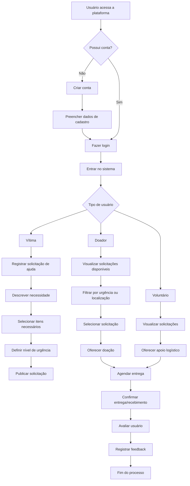
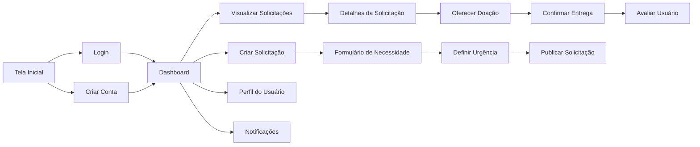

# Projeto de Interface

Pré-requisitos: <a href="2-Especificação do Projeto.md"> Documentação de Especificação</a>

Visão geral da interação do usuário pelas telas do sistema e protótipo interativo das telas com as funcionalidades que fazem parte do sistema (wireframes).

 Apresente as principais interfaces da plataforma. Discuta como ela foi elaborada de forma a atender os requisitos funcionais, não funcionais e histórias de usuário abordados nas <a href="2-Especificação do Projeto.md"> Documentação de Especificação</a>.

## Diagrama de Fluxo

O fluxograma a seguir apresenta o fluxo principal de interação entre os usuários e a plataforma Conexão Solidária. Seu objetivo é representar, de forma visual, as etapas realizadas desde o acesso inicial ao sistema até a conclusão do processo de ajuda entre os participantes. 

Nesse fluxo são considerados diferentes perfis de usuários, como pessoas afetadas por desastres naturais, doadores e voluntários, destacando as principais ações realizadas por cada um dentro da plataforma:

<!--
O diagrama apresenta o estudo do fluxo de interação do usuário com o sistema interativo e  muitas vezes sem a necessidade do desenho do design das telas da interface. Isso permite que o design das interações seja bem planejado e gere impacto na qualidade no design do wireframe interativo que será desenvolvido logo em seguida.

O diagrama de fluxo pode ser desenvolvido com “boxes” que possuem internamente a indicação dos principais elementos de interface - tais como menus e acessos - e funcionalidades, tais como editar, pesquisar, filtrar, configurar - e a conexão entre esses boxes a partir do processo de interação. Você pode ver mais explicações e exemplos https://www.lucidchart.com/blog/how-to-make-a-user-flow-diagram.

As referências abaixo irão auxiliá-lo na geração do artefato “Diagramas de Fluxo”.

> **Links Úteis**:
> - [Fluxograma online: seis sites para fazer gráfico sem instalar nada | Produtividade | TechTudo](https://www.techtudo.com.br/listas/2019/03/fluxograma-online-seis-sites-para-fazer-grafico-sem-instalar-nada.ghtml)
-->

## Wireframes

O wireframe representa uma estrutura visual simplificada das principais telas do aplicativo Conexão Solidária, demonstrando a organização dos elementos da interface e o fluxo de navegação entre as funcionalidades. Seu objetivo é apresentar uma visão inicial da experiência do usuário, sem foco em aspectos visuais detalhados, como cores ou design final.

Por meio desse modelo, é possível compreender como os usuários acessarão funcionalidades como cadastro, login, registro de solicitações de ajuda, visualização de pedidos e confirmação de doações:

### Wireframe das Telas

#### Tela Inicial

+----------------------------------+
|        CONEXÃO SOLIDÁRIA         |
|                                  |
|        [ Fazer Login ]           |
|                                  |
|        [ Criar Conta ]           |
|                                  |
|   [ Ver Solicitações ]           |
+----------------------------------+

#### Dashboard

+----------------------------------+
| Menu                             |
|----------------------------------|
|  Nova Solicitação                |
|                                  |
|  Ver Solicitações                | 
|                                  |
|  Notificações                    |
|                                  | 
|  Perfil                          |
+----------------------------------+

#### Lista de Solicitações

+----------------------------------+
| Solicitações de Ajuda            |
|----------------------------------|
| Alimentos - URGENTE              |
|                                  |
| Cobertores - MÉDIO               |
|                                  
| Água Potável - ALTA              |
|                                  |
| [Ver detalhes]                   |
+----------------------------------+

#### Cadastro de Solicitação

+----------------------------------+
| Nova Solicitação                 |
|----------------------------------|
| Item Necessário                  | 
|                                  |
| Quantidade                       | 
|                                  |
| Descrição                        | 
|                                  |
| Nível de urgência                |
|                                  |
| [Publicar Solicitação]           |
+----------------------------------+

#### Perfil do Usuário

+----------------------------------+
| Perfil                           |
|----------------------------------|
| Nome                             |
|                                  |
| Histórico de Ajuda               |
|                                  |
| Avaliações                       |
|                                  |
| [Editar Perfil]                  |
+----------------------------------+

<!--

Os wireframes são protótipos utilizados no design de interfaces para representar a estrutura de um site e o relacionamento entre suas páginas. Eles funcionam como ilustrações do layout e da disposição dos elementos essenciais da interface.

Nesta seção, é FUNDAMENTAL indicar, para cada tela/wireframe proposto, quais requisitos do projeto estão sendo contemplados por aquela tela.
 
> **Links Úteis**:
> - [Protótipos vs Wireframes](https://www.nngroup.com/videos/prototypes-vs-wireframes-ux-projects/)
> - [Ferramentas de Wireframes](https://rockcontent.com/blog/wireframes/)
> - [MarvelApp](https://marvelapp.com/developers/documentation/tutorials/)
> - [Figma](https://www.figma.com/)
> - [Adobe XD](https://www.adobe.com/br/products/xd.html#scroll)
> - [Axure](https://www.axure.com/edu) (Licença Educacional)
> - [InvisionApp](https://www.invisionapp.com/) (Licença Educacional)
-->