# Projeto de Interface

Pré-requisitos: <a href="2-Especificação do Projeto.md"> Documentação de Especificação</a>

Visão geral da interação do usuário pelas telas do sistema e protótipo interativo das telas com as funcionalidades que fazem parte do sistema (wireframes).

 Apresente as principais interfaces da plataforma. Discuta como ela foi elaborada de forma a atender os requisitos funcionais, não funcionais e histórias de usuário abordados nas <a href="2-Especificação do Projeto.md"> Documentação de Especificação</a>.

## Diagrama de Fluxo

O fluxograma a seguir apresenta o fluxo principal de interação entre os usuários e a plataforma Conexão Solidária. Seu objetivo é representar, de forma visual, as etapas realizadas desde o acesso inicial ao sistema até a conclusão do processo de ajuda entre os participantes. 

Nesse fluxo são considerados diferentes perfis de usuários, como pessoas afetadas por desastres naturais, doadores e voluntários, destacando as principais ações realizadas por cada um dentro da plataforma:
<figure >
 
</figure>

## WireFrames

Conforme fluxo de telas do projeto amostrado no item anterior, as telas do sistema são apresentadas em detalhes nos itens que se seguem. Todas essas telas têm uma estrutura comum que é apresentada na Figura 5. Nesta estrutura existem 3 grandes blocos, descritos a seguir. São eles:

- **Cabeçalho** — local onde são dispostos elementos fixos de identidade (logo), links de navegação principais e ícone de usuário;
- **Conteúdo** — apresenta o conteúdo da tela em questão, organizado em até duas colunas conforme a complexidade da página;
- **Menu lateral** — apresenta o menu da aplicação que permite navegar pelas páginas principais: Início, Solicitações, Doações, Chat e Perfil.

<figure>
  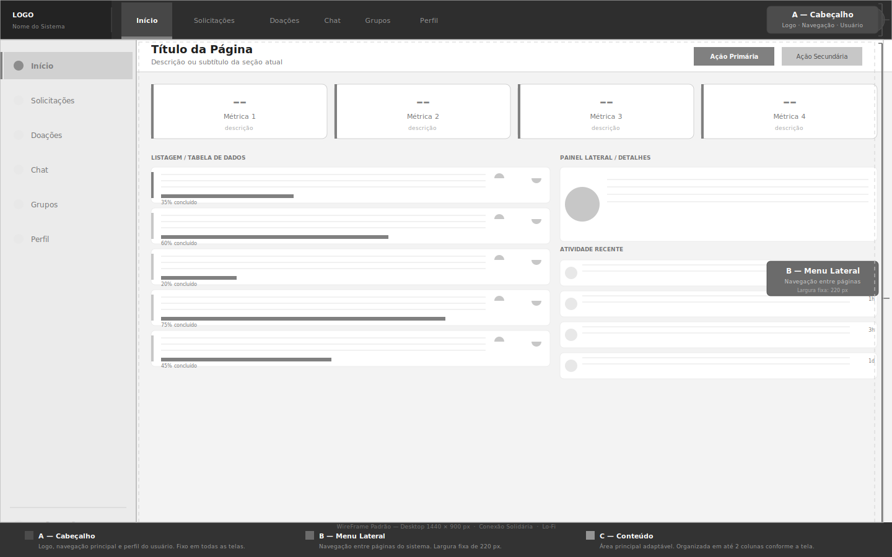
  <figcaption>Figura 5 – Estrutura padrão das telas do sistema Conexão Solidária</figcaption>
</figure>

---

### Fluxo de Autenticação

O fluxo de autenticação compreende as telas de entrada no sistema, cobrindo os caminhos de acesso para usuários novos e recorrentes. O fluxo se inicia na **Tela Inicial** (landing page), que apresenta a identidade visual da plataforma e as opções de entrada. A partir dela, o usuário pode acessar a tela de **Login** — com campos de e-mail e senha, opção de acesso via Google e link para recuperação de senha — ou seguir para **Criar Conta**, onde preenche nome completo, e-mail, telefone e senha. Após autenticação bem-sucedida, o usuário é direcionado ao **Dashboard**, tela principal do sistema.

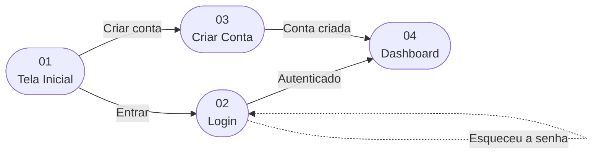
```mermaid
flowchart LR
    A(["01\nTela Inicial"])
    B(["02\nLogin"])
    C(["03\nCriar Conta"])
    D(["04\nDashboard"])

    A -->|"Entrar"| B
    A -->|"Criar conta"| C
    B -->|"Autenticado"| D
    C -->|"Conta criada"| D
    B -.->|"Esqueceu a senha"| B
```

<figure>
  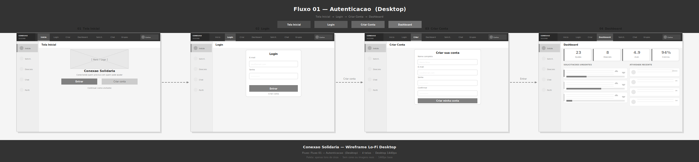
  <figcaption>Figura 6 – Fluxo de Autenticação (visão geral das telas)</figcaption>
</figure>

#### Tela 01 — Tela Inicial

Ponto de entrada da aplicação. Apresenta a identidade visual da plataforma, imagem de fundo ilustrativa e os dois caminhos de acesso: entrar com conta existente ou criar uma nova conta.

<figure>
  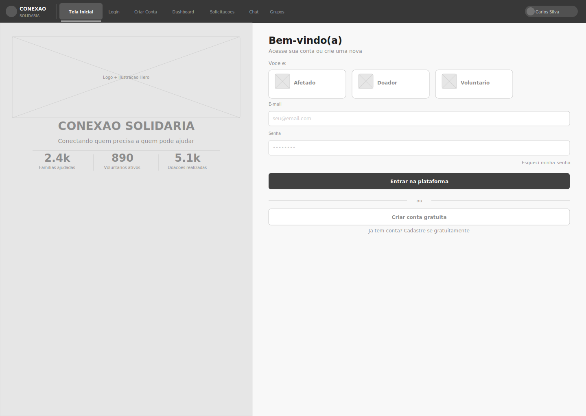
  <figcaption>Figura 7 – WireFrame da Tela Inicial</figcaption>
</figure>

#### Tela 02 — Login

Formulário de autenticação com campos de e-mail e senha, opção de acesso via Google, link para recuperação de senha e atalho para criação de nova conta.

<figure>
  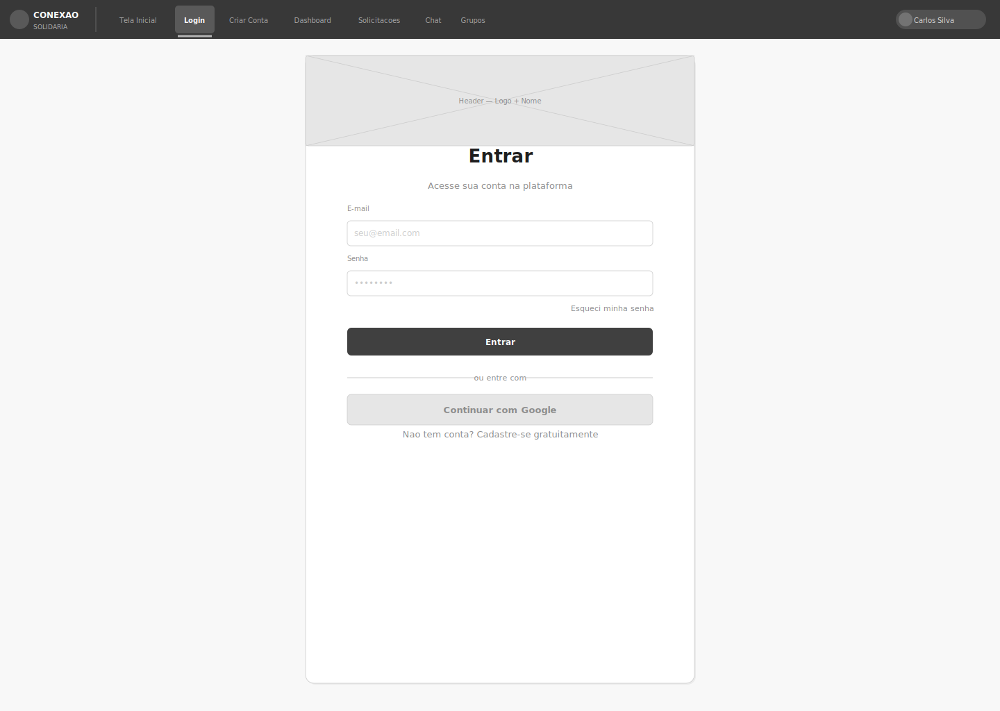
  <figcaption>Figura 8 – WireFrame da tela de Login</figcaption>
</figure>

#### Tela 03 — Criar Conta

Formulário de cadastro com campos de nome completo, e-mail, telefone, senha e confirmação de senha. Inclui link para os Termos de Uso e Política de Privacidade.

<figure>
  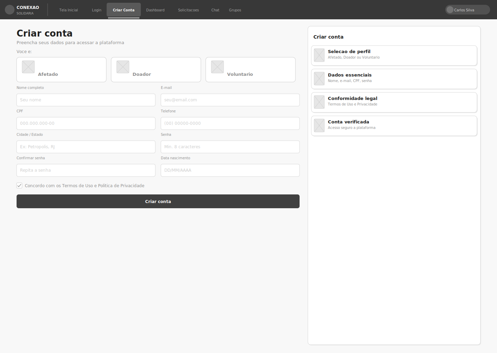
  <figcaption>Figura 9 – WireFrame da tela de Criar Conta</figcaption>
</figure>

#### Tela 04 — Dashboard

Tela principal do sistema, exibida logo após a autenticação. Apresenta as estatísticas do usuário (ajudas realizadas, doações e avaliação média), ações rápidas de nova solicitação e oferta de ajuda, e a lista das solicitações urgentes mais próximas.

<figure>
  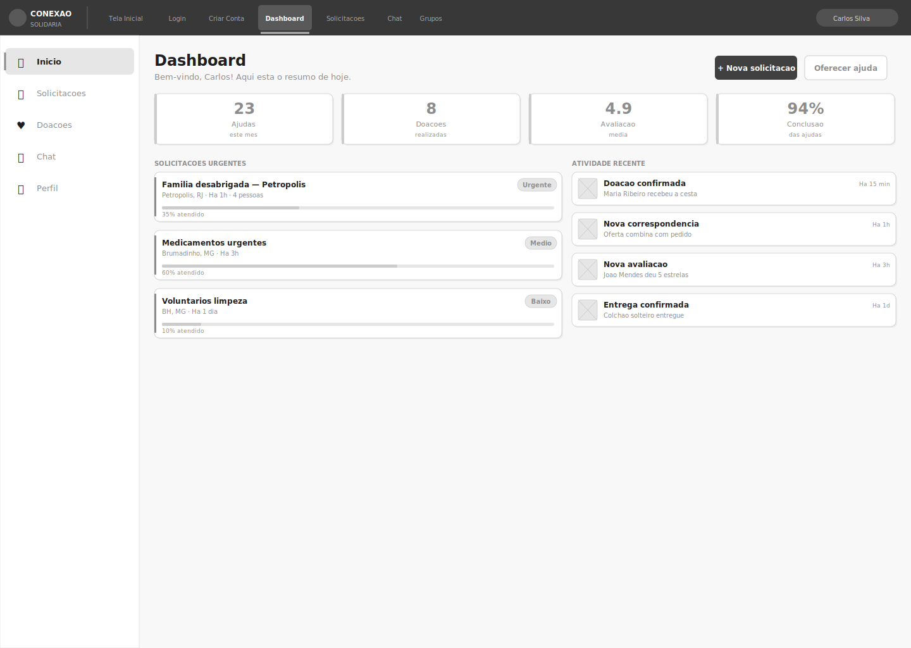
  <figcaption>Figura 10 – WireFrame do Dashboard</figcaption>
</figure>

---

### Fluxo de Solicitação e Ajuda

Este é o fluxo central da plataforma, responsável por conectar quem precisa de ajuda com quem pode oferecê-la. O fluxo parte do **Dashboard** e percorre as etapas de descoberta, oferta, confirmação, avaliação e encerramento de uma ajuda.

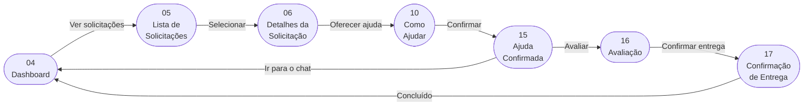
```mermaid
flowchart LR
    D(["04\nDashboard"])
    E(["05\nLista de\nSolicitações"])
    F(["06\nDetalhes da\nSolicitação"])
    G(["10\nComo\nAjudar"])
    H(["15\nAjuda\nConfirmada"])
    I(["16\nAvaliação"])
    J(["17\nConfirmação\nde Entrega"])

    D -->|"Ver solicitações"| E
    E -->|"Selecionar"| F
    F -->|"Oferecer ajuda"| G
    G -->|"Confirmar"| H
    H -->|"Ir para o chat"| D
    H -->|"Avaliar"| I
    I -->|"Confirmar entrega"| J
    J -->|"Concluído"| D
```

<figure>
  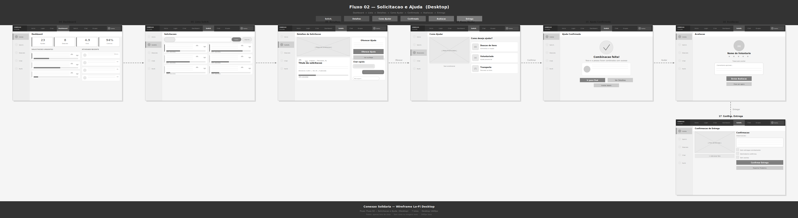
  <figcaption>Figura 11 – Fluxo de Solicitação e Ajuda (visão geral das telas)</figcaption>
</figure>

#### Tela 05 — Lista de Solicitações

Listagem de solicitações ativas com barra de busca e filtros por urgência, proximidade e recência. Cada card exibe título, localização, badge de urgência e barra de progresso de atendimento. No desktop, os cards são organizados em duas colunas.

<figure>
  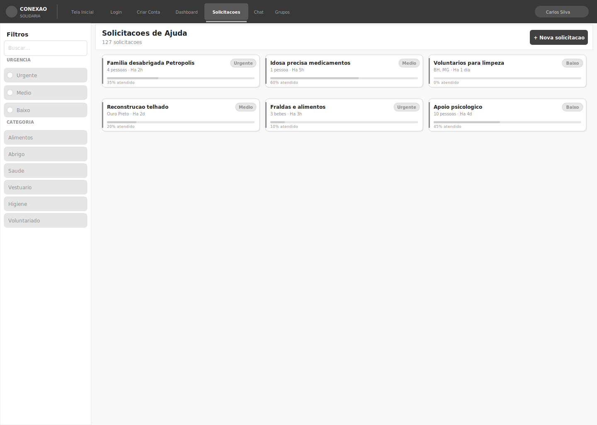
  <figcaption>Figura 12 – WireFrame da tela de Lista de Solicitações</figcaption>
</figure>

#### Tela 06 — Detalhes da Solicitação

Exibe o mapa de localização da solicitação, informações completas (tipo de necessidade, distância, tempo decorrido, número de pessoas), barra de progresso do atendimento e os botões de ação para oferecer ajuda ou visualizar no mapa.

<figure>
  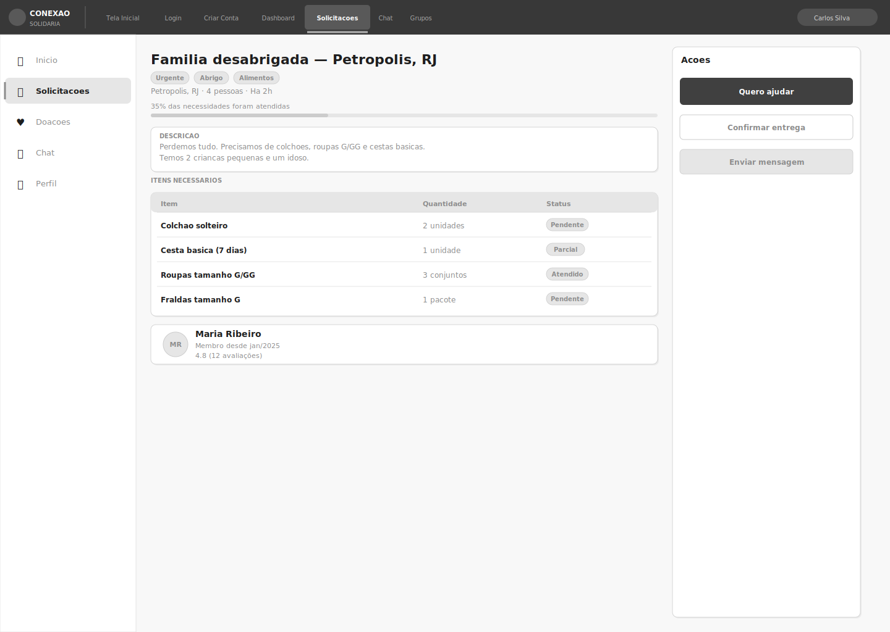
  <figcaption>Figura 13 – WireFrame da tela de Detalhes da Solicitação</figcaption>
</figure>

#### Tela 10 — Como Ajudar

Permite ao usuário escolher a modalidade de apoio: doação de itens (alimentos, roupas e outros), voluntariado presencial ou transporte de pessoas e itens. Exibe mapa de proximidade para facilitar a decisão.

<figure>
  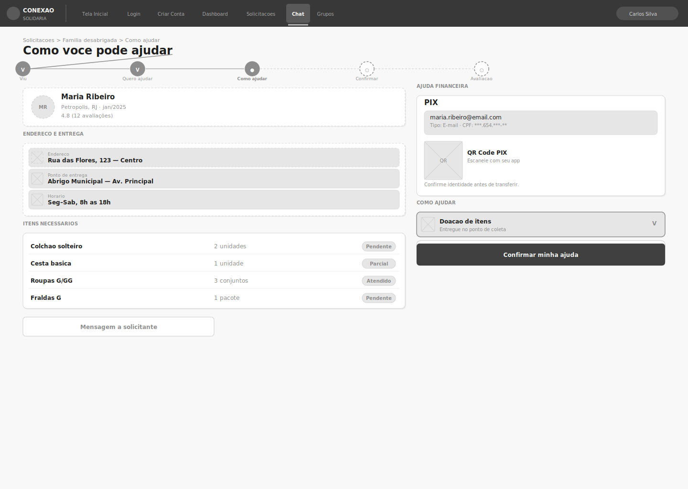
  <figcaption>Figura 14 – WireFrame da tela de Como Ajudar</figcaption>
</figure>

#### Tela 15 — Ajuda Confirmada

Tela de feedback exibida após a combinação bem-sucedida entre ofertante e solicitante. Apresenta os dados da combinação e oferece acesso direto ao chat, aos detalhes da solicitação ou a opção de avaliar posteriormente.

<figure>
  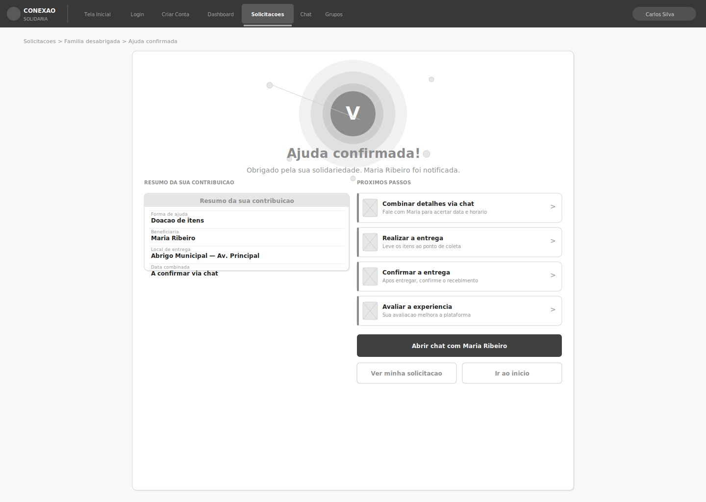
  <figcaption>Figura 15 – WireFrame da tela de Ajuda Confirmada</figcaption>
</figure>

#### Tela 16 — Avaliação

Permite avaliar a experiência com sistema de estrelas e campo de comentário opcional. A avaliação é vinculada ao perfil do voluntário e contribui para a pontuação de reputação na plataforma.

<figure>
  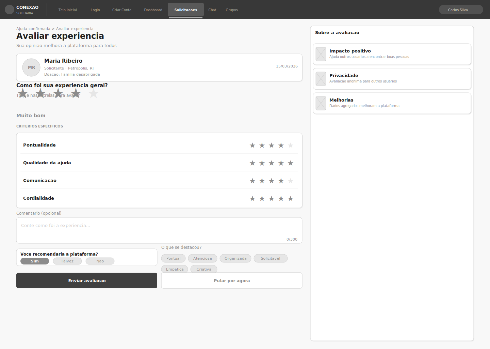
  <figcaption>Figura 16 – WireFrame da tela de Avaliação</figcaption>
</figure>

#### Tela 17 — Confirmação de Entrega

Tela de encerramento do ciclo de ajuda. O usuário registra uma foto da entrega, preenche observações, marca uma checklist de verificação e confirma a conclusão. Caso haja algum problema, pode reportar a ocorrência antes de encerrar.

<figure>
  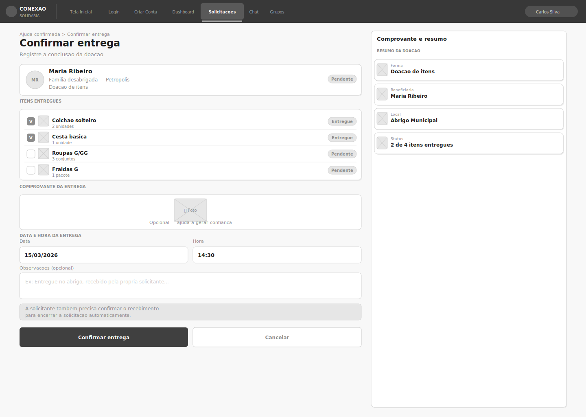
  <figcaption>Figura 17 – WireFrame da tela de Confirmação de Entrega</figcaption>
</figure>

---

### Fluxo de Chat e Mensagens

O fluxo de chat permite a comunicação direta entre os participantes de uma ajuda confirmada, bem como o acesso a conversas anteriores. A partir do **Dashboard** ou do ícone de chat no menu lateral, o usuário acessa a lista de conversas ativas e navega para uma conversa individual. No desktop, o layout adota estrutura de painel dividido.

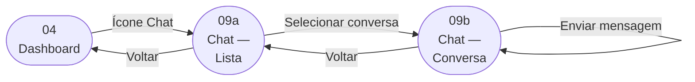
```mermaid
flowchart LR
    D(["04\nDashboard"])
    CA(["09a\nChat —\nLista"])
    CB(["09b\nChat —\nConversa"])

    D -->|"Ícone Chat"| CA
    CA -->|"Selecionar conversa"| CB
    CB -->|"Enviar mensagem"| CB
    CB -->|"Voltar"| CA
    CA -->|"Voltar"| D
```

<figure>
  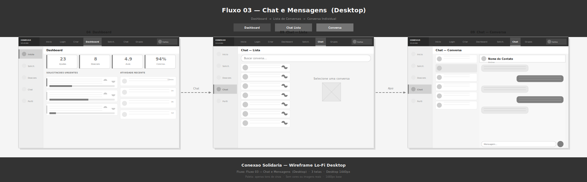
  <figcaption>Figura 18 – Fluxo de Chat e Mensagens (visão geral das telas)</figcaption>
</figure>

#### Tela 09a — Chat — Lista de Conversas

Exibe todas as conversas ativas do usuário com indicação de mensagens não lidas e timestamp da última mensagem. A barra de busca permite localizar conversas por nome de contato. No desktop, um painel de preview é exibido ao lado da lista.

<figure>
  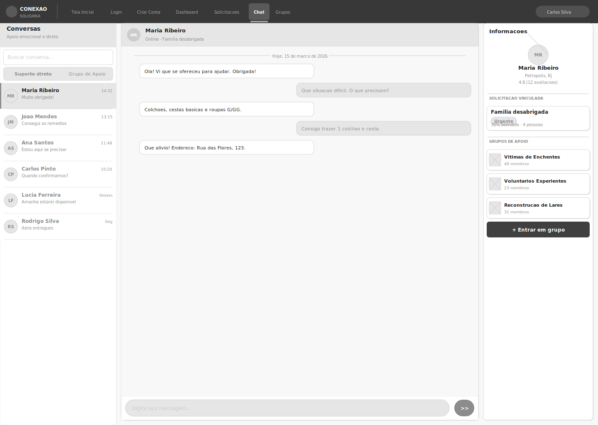
  <figcaption>Figura 19 – WireFrame da tela de Chat — Lista de Conversas</figcaption>
</figure>

#### Tela 09b — Chat — Conversa Individual

Layout em duas colunas no desktop: à esquerda a lista de contatos permite alternar entre conversas sem sair da tela; à direita a área principal exibe o histórico de mensagens com bolhas diferenciadas por remetente e o campo de entrada de texto na parte inferior.

---

### Fluxo de Grupos Solidários

O fluxo de grupos permite a organização coletiva de ações de solidariedade, reunindo voluntários e beneficiários em torno de causas comuns. O fluxo abrange a criação de novos grupos, o acesso a grupos existentes, a participação na sala de chat coletivo e o compartilhamento para captação de novos membros.

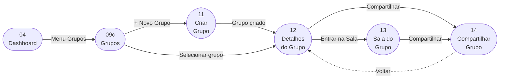
```mermaid
flowchart LR
    D(["04\nDashboard"])
    G(["09c\nGrupos"])
    CG(["11\nCriar\nGrupo"])
    DG(["12\nDetalhes\ndo Grupo"])
    SG(["13\nSala do\nGrupo"])
    CS(["14\nCompartilhar\nGrupo"])

    D -->|"Menu Grupos"| G
    G -->|"+ Novo Grupo"| CG
    CG -->|"Grupo criado"| DG
    G -->|"Selecionar grupo"| DG
    DG -->|"Entrar na Sala"| SG
    DG -->|"Compartilhar"| CS
    SG -->|"Compartilhar"| CS
    CS -.->|"Voltar"| DG
```

<figure>
  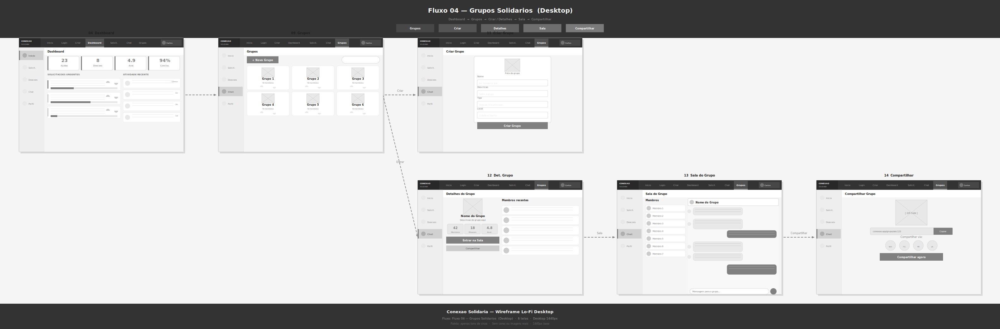
  <figcaption>Figura 20 – Fluxo de Grupos Solidários (visão geral das telas)</figcaption>
</figure>

#### Tela 09c — Grupos

Exibe os grupos disponíveis em grid de três colunas com foto, nome, número de membros e indicador de atividade recente. Um botão de destaque no topo da tela permite criar um novo grupo diretamente a partir desta listagem.

#### Tela 11 — Criar Grupo

Formulário para criação de um novo grupo com campos de foto, nome, descrição, tipo de atividade (doação, voluntariado ou misto) e localização. Após o envio, o usuário é redirecionado para os Detalhes do grupo recém-criado.

<figure>
  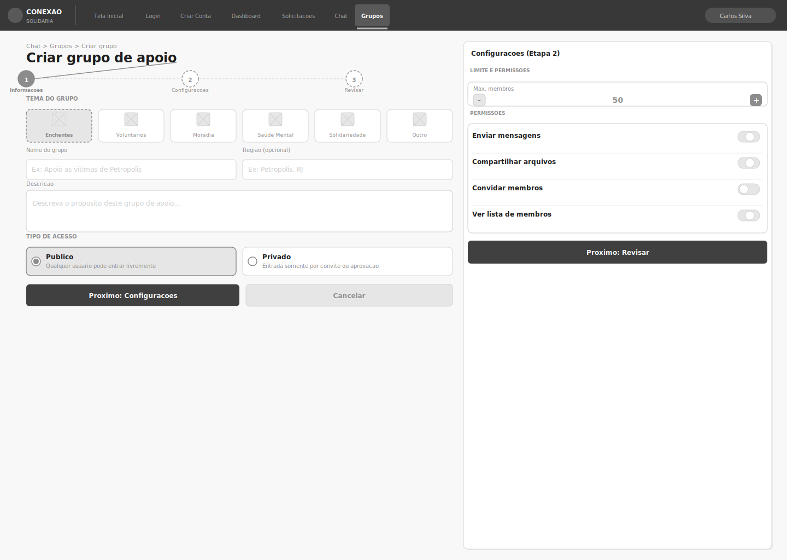
  <figcaption>Figura 21 – WireFrame da tela de Criar Grupo</figcaption>
</figure>

#### Tela 12 — Detalhes do Grupo

Exibe foto, nome e descrição do grupo, além das estatísticas (número de membros, missões concluídas e avaliação média). Lista os membros mais recentes e disponibiliza os botões de acesso à sala de chat coletivo e de compartilhamento do grupo.

<figure>
  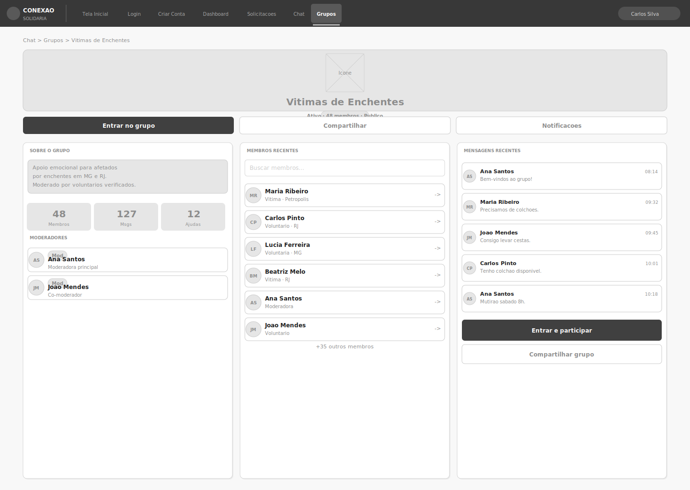
  <figcaption>Figura 22 – WireFrame da tela de Detalhes do Grupo</figcaption>
</figure>

#### Tela 13 — Sala do Grupo

Chat coletivo do grupo. No desktop, adota layout em duas colunas: lista de membros ativos à esquerda e área principal de mensagens à direita, com campo de entrada na parte inferior. Exibe indicação de presença online dos membros.

<figure>
  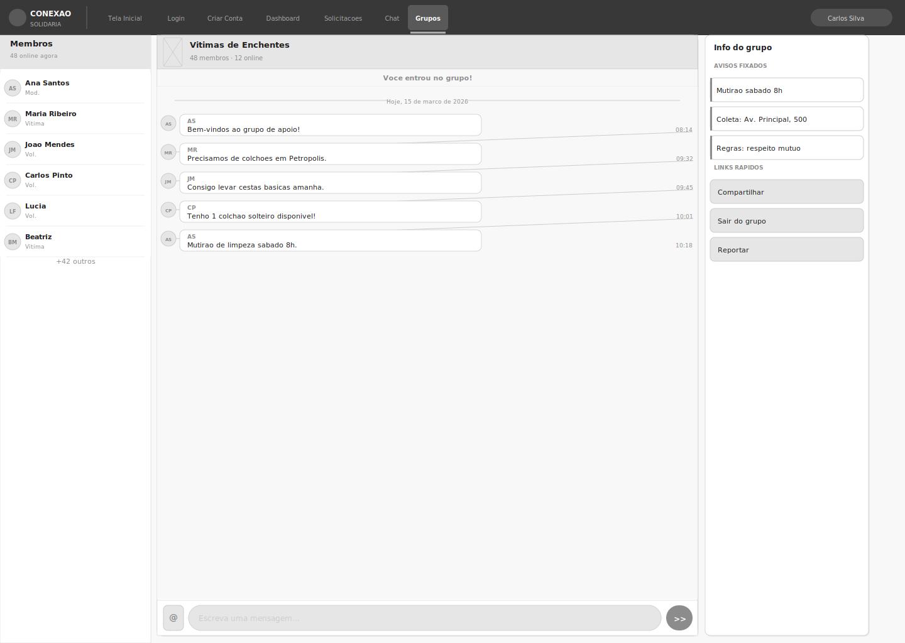
  <figcaption>Figura 23 – WireFrame da tela de Sala do Grupo</figcaption>
</figure>

#### Tela 14 — Compartilhar Grupo

Permite convidar novas pessoas para o grupo por meio de QR Code, link copiável ou compartilhamento direto via aplicativos de mensagens (WhatsApp, Telegram, Facebook e LinkedIn).

<figure>
  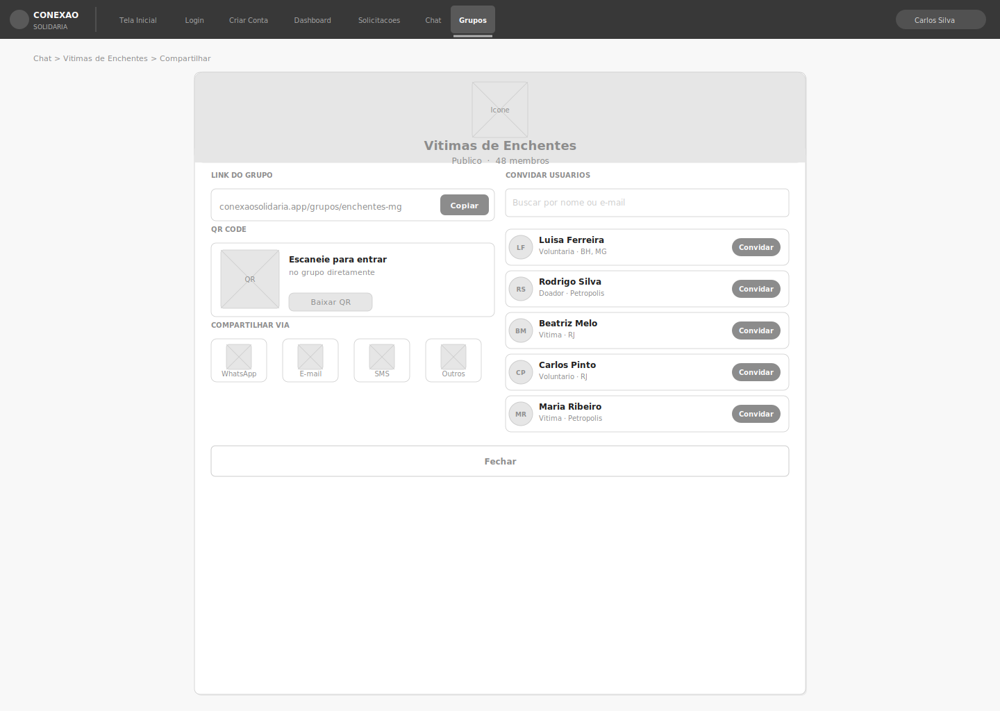
  <figcaption>Figura 24 – WireFrame da tela de Compartilhar Grupo</figcaption>
</figure>
