# Template Padrão da Aplicação

O **Template Padrão** do projeto **Conexão Solidária** define a identidade visual, a estrutura de layout e os componentes reutilizáveis que sustentam todas as telas da plataforma. Este documento consolida as decisões de design adotadas no protótipo de alta fidelidade construído para resolução **desktop (1440 × 900 px)**, organizando-as em três dimensões complementares: **(i)** identidade visual e tipografia, **(ii)** estrutura de layout e componentes recorrentes, e **(iii)** descrição funcional de cada uma das **dezenove telas** que compõem os quatro fluxos da plataforma.

A proposta visual comunica **acolhimento e confiança**, dois valores fundamentais para uma plataforma humanitária. O azul institucional transmite segurança, o turquesa traz acolhimento e o laranja sinaliza esperança e ação — convidando o usuário a participar ativamente da rede de ajuda mútua.

---

## 1. Identidade Visual

### 1.1 Paleta de Cores Oficial

Todas as cores são declaradas como **CSS Custom Properties** no seletor `:root` do arquivo `src/wwwroot/css/site.css`, permitindo manutenção centralizada e propagação automática para todos os componentes.

| Função | Variável CSS | Hex | Aplicação |
|--------|-------------|-----|-----------|
| Cor primária | `--primary` | `#1E73BE` | Header, botões principais, links ativos, bolhas do próprio usuário no chat |
| Primária escura | `--primary-d` | `#155A99` | Hover de botões primários |
| Cor secundária | `--secondary` | `#5CBFC2` | Gradientes, avatares de contatos, elementos de apoio |
| Cor de destaque | `--accent` | `#F28C28` | CTAs, avatar do usuário, logo, botões de conversão |
| Texto principal | `--txt` | `#1A1A2E` | Títulos e corpo de texto |
| Texto secundário | `--txt-2` | `#5A6478` | Legendas, metadados, placeholders |
| Borda | `--bdr` | `#E2E8F0` | Cards, inputs, divisórias |
| Superfície | `--surf` | `#F8FAFD` | Fundo da área de conteúdo, inputs |
| Branco | `--white` | `#FFFFFF` | Cards, sidebar, áreas de conteúdo |
| Estado de erro | `--danger` | `#DC3545` | Badge de urgência alta, indicador de mensagens não lidas, mensagens de erro |
| Estado de aviso | `--warn` | `#F0AD4E` | Badge de urgência média, status "em andamento" |
| Estado de sucesso | `--ok` | `#2DBE60` | Badge de urgência baixa, indicador de presença online, confirmação de entrega |

### 1.2 Tipografia

O projeto adota uma **font stack nativa**, garantindo carregamento instantâneo, legibilidade consistente entre sistemas operacionais e ausência total de dependências externas:

```css
font-family: -apple-system, "Segoe UI", Roboto, Helvetica, Arial, sans-serif;
```

A hierarquia tipográfica é controlada pela combinação de tamanho e peso:

| Elemento | Tamanho | Peso |
|----------|---------|------|
| Título de página (h1) | 24 px | 800 |
| Subtítulo de seção (h2) | 18 px | 700 |
| Corpo de texto | 14–15 px | 400 |
| Metadados | 13 px | 500 |
| Legendas | 11–12 px | 400 |
| Stat card (valor numérico) | 32 px | 800 |

### 1.3 Iconografia

Foi adotada uma estratégia de **iconografia híbrida**, priorizando **simplicidade e zero dependências adicionais**:

| Categoria | Solução adotada | Exemplos |
|-----------|------------------|----------|
| Navegação principal | Emojis Unicode | 🏠 Início, 📋 Solicitações, 🎁 Doações, 💬 Chat, 👥 Grupos, 👤 Perfil |
| Status e urgência | Cores semânticas + texto | 🔴 ALTA / 🟡 MÉDIA / 🟢 BAIXA |
| Ações contextuais | Símbolos Unicode | ↪ Sair, ← Voltar, + Adicionar, → Acessar |
| Metadados | Emojis Unicode | 📍 Localização, 🕒 Data, 🏷 Categoria, 👤 Autor |
| Avaliação | Estrela vetorial customizada | ★ ★ ★ ★ ☆ |

A escolha por emojis Unicode é deliberada por três razões: **(i)** renderização nativa em todos os sistemas operacionais modernos sem fontes ou bibliotecas adicionais; **(ii)** acessibilidade nativa via leitores de tela; e **(iii)** consistência visual em qualquer dispositivo.

---

## 2. Estrutura de Layout

O Template Padrão se organiza em **dois layouts mestres** definidos em `src/Pages/Shared/`, cada um servindo a um conjunto distinto de telas.

### 2.1 Layout Autenticado (`_Layout.cshtml`)

Aplicado a todas as telas internas (04 a 17). Combina três regiões fixas: **Header**, **Sidebar lateral** e **Área de conteúdo**.

```
┌──────────────────────────────────────────────────────────┐
│  HEADER FIXO (64px) — Logo + Brand + Avatar do usuário   │
├──────────┬───────────────────────────────────────────────┤
│ SIDEBAR  │                                               │
│  220px   │       ÁREA DE CONTEÚDO                        │
│          │       (renderiza @RenderBody)                 │
│  Início  │                                               │
│  Solic.  │                                               │
│  Doaç.   │                                               │
│  Chat    │                                               │
│  Grupos  │                                               │
│  Perfil  │                                               │
│          │                                               │
│  ⚙ Config│                                               │
└──────────┴───────────────────────────────────────────────┘
```

**Especificações:**

- **Header:** altura 64 px, fundo `--primary` (#1E73BE), elemento `position: fixed` com `z-index: 100`. Contém logo CS (36×36 px, fundo laranja), nome da marca em duas linhas (CONEXÃO em branco e SOLIDÁRIA em laranja) e pílula do usuário no canto direito (avatar 28 px + nome + atalho de logout).
- **Sidebar:** largura fixa de 220 px, fundo `--white`, borda direita `--bdr`. **Seis itens principais** de navegação com ícone + label (Início, Solicitações, Doações, Chat, Grupos, Perfil), item ativo destacado com fundo `rgba(30,115,190,0.1)` e borda esquerda azul de 3 px. Footer com link "Configurações" separado por divisória.
- **Área de conteúdo:** flex 1, fundo `--surf` (#F8FAFD), `margin-left: 220px`, `padding: 28px 32px`.

### 2.2 Layout Público (`_LayoutPublic.cshtml`)

Aplicado às Telas 01, 02 e 03. Layout simplificado com fundo em **gradiente diagonal** azul → turquesa e card centralizado, otimizado para conversão (login e cadastro).

```css
background: linear-gradient(135deg, #1E73BE 0%, #5CBFC2 100%);
```

O card branco (largura entre 480 e 540 px conforme a tela), com `border-radius: 16px` e `box-shadow: 0 12px 36px rgba(0,0,0,0.18)`, ocupa o centro vertical e horizontal da viewport.

### 2.3 Componentes Reutilizáveis

Para garantir consistência visual entre todas as telas, foram criadas classes CSS reutilizáveis com o prefixo `cs-`:

| Classe | Função |
|--------|--------|
| `.cs-stat-card` | Card de indicador numérico usado no Dashboard e em Detalhes do Grupo |
| `.cs-solic-card` | Card de solicitação usado nas listagens |
| `.cs-badge.alta / .media / .baixa` | Badges coloridos de urgência (atendendo RF08) |
| `.cs-progress` | Barra de progresso de atendimento de solicitação |
| `.cs-chip` | Chips de filtro usados nas listagens |
| `.cs-msg-bubble.me / .other` | Bolhas de mensagem do chat (próprio usuário em azul, outros em superfície) |
| `.cs-online-dot` | Indicador circular verde de presença online |
| `.btn-cs-primary` | Botão principal azul (`--primary`) |
| `.btn-cs-accent` | Botão de destaque laranja (`--accent`) |
| `.cs-page-header` | Cabeçalho padrão de cada página interna |
| `.cs-form` | Estilização padrão de formulários com labels destacados |

### 2.4 Espaçamentos e Border Radius

| Elemento | Valor |
|----------|-------|
| Padding interno de cards | 20–24 px |
| Margens entre cards | 12–16 px |
| Border radius de cards | 12 px |
| Border radius de inputs e botões | 8 px |
| Border radius de bolhas de chat | 14 px |
| Border radius de badges e chips | 11–16 px (pill) |
| Border radius do logo | 8–14 px (variável conforme contexto) |

---

## 3. Descrição das Telas

A seguir, a explicação concisa de cada uma das **dezenove telas** geradas como wireframe de alta fidelidade. As imagens estão em `docs/img/wireframes-hifi/` (resolução 1440 × 900 px, PNG). As telas estão organizadas pelos **quatro fluxos** definidos no Projeto de Interface.

### 3.1 Fluxo de Autenticação

#### Tela 01 — Tela Inicial

<figure>
  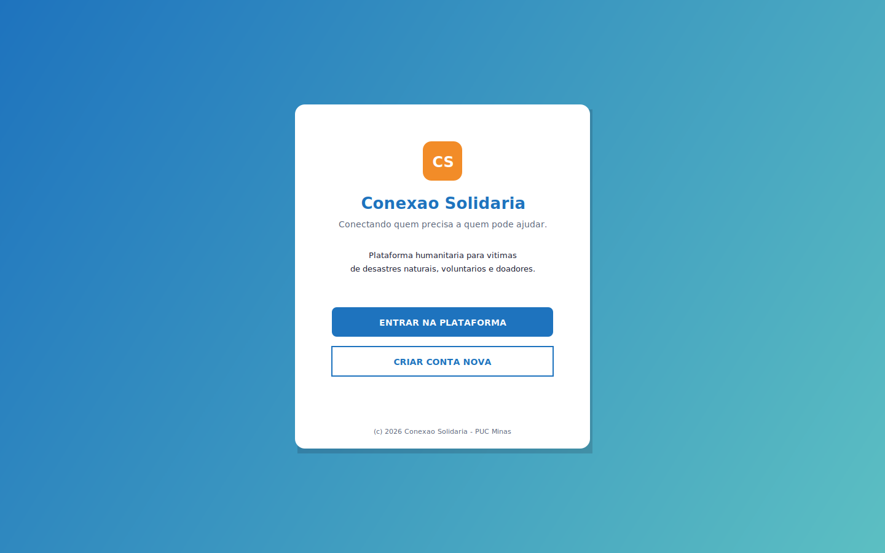
  <figcaption>Figura 28 – WireFrame da Tela Inicial.</figcaption>
</figure>

Porta de entrada da plataforma. Apresenta a marca **Conexão Solidária** em destaque sobre fundo em gradiente azul-turquesa, com card branco centralizado contendo logo, slogan ("Conectando quem precisa a quem pode ajudar"), descrição da proposta humanitária e dois CTAs hierarquizados: **"Entrar na Plataforma"** (botão primário azul) e **"Criar Conta Nova"** (botão secundário com contorno azul). Layout otimizado para conversão e primeira impressão da marca.

#### Tela 02 — Login (RF02)

<figure>
  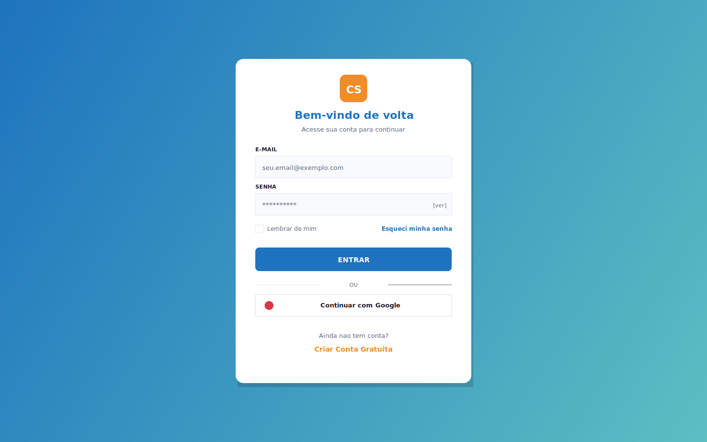
  <figcaption>Figura 29 – WireFrame da tela de Login.</figcaption>
</figure>

Formulário de autenticação com card centralizado. Contém logo da marca, título acolhedor, campos de **e-mail** e **senha** (com toggle de visualização), checkbox **"Lembrar de mim"**, link **"Esqueci minha senha"**, botão primário **"Entrar"** em azul e divisor com **opção de acesso via Google** (botão secundário com ícone). Seção inferior com CTA de cadastro **"Criar Conta Gratuita"** em destaque laranja para usuários novos.

#### Tela 03 — Criar Conta (RF01)

<figure>
  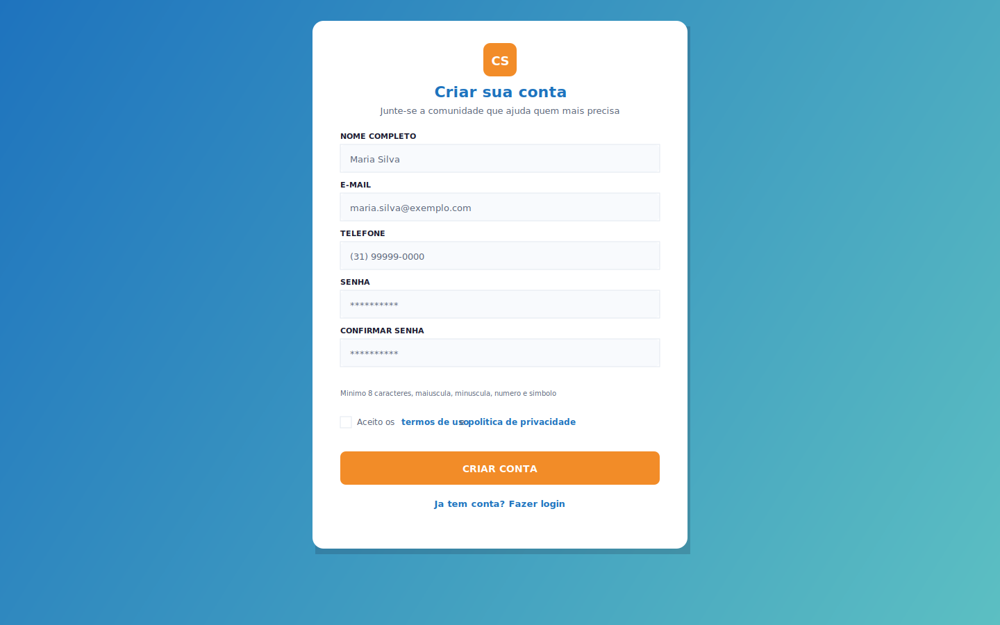
  <figcaption>Figura 30 – WireFrame da tela de Criar Conta.</figcaption>
</figure>

Formulário de cadastro com cinco campos sequenciais: **nome completo**, **e-mail**, **telefone**, **senha** e **confirmação de senha**. Abaixo dos campos, mensagem informativa sobre regras de complexidade da senha e checkbox de aceite dos **Termos de Uso** e **Política de Privacidade** com links destacados em azul. CTA principal **"Criar Conta"** em laranja para impulso à conversão.

#### Tela 04 — Dashboard (RF06)

<figure>
  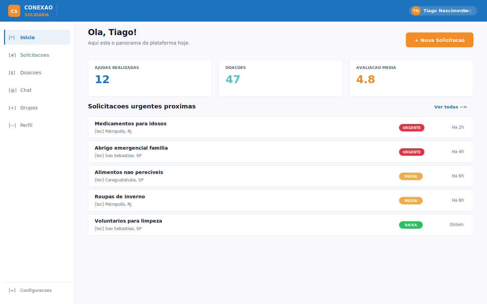
  <figcaption>Figura 31 – WireFrame do Dashboard.</figcaption>
</figure>

Painel principal exibido após autenticação. Apresenta saudação personalizada **"Olá, Tiago!"** seguida de mensagem contextual e CTA **"+ Nova Solicitação"** posicionado no canto superior direito. Três **stat cards** em linha mostram indicadores agregados em destaque: **Ajudas Realizadas**, **Doações** e **Avaliação Média** — cada um colorido com a paleta semântica. Abaixo, seção **"Solicitações urgentes próximas"** com link **"Ver todas →"** e lista compacta de cinco itens contendo título, localização, badge de urgência e tempo desde publicação.

### 3.2 Fluxo de Solicitação e Ajuda

#### Tela 05 — Lista de Solicitações (RF06, RF08)

<figure>
  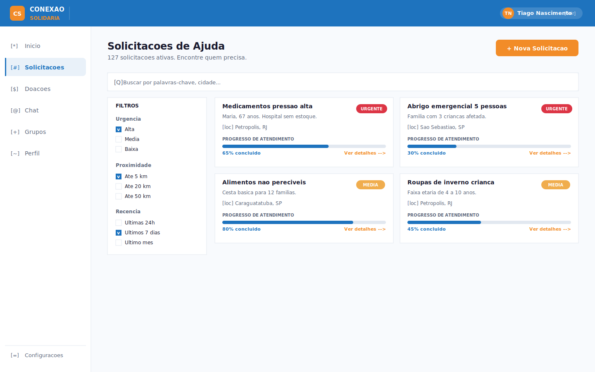
  <figcaption>Figura 32 – Lista de Solicitações.</figcaption>
</figure>

Listagem de solicitações ativas com **barra de busca** no topo e layout em duas colunas. À esquerda, painel de filtros (240 px) com seções para **Urgência** (Alta, Média, Baixa), **Proximidade** (Até 5 km, 20 km, 50 km) e **Recência** (Últimas 24h, 7 dias, mês). À direita, **grid de 2 colunas** de cards de solicitação contendo título, descrição resumida, localização, badge de urgência e **barra de progresso de atendimento** com percentual concluído.

#### Tela 06 — Detalhes da Solicitação (RF06, RF08)

<figure>
  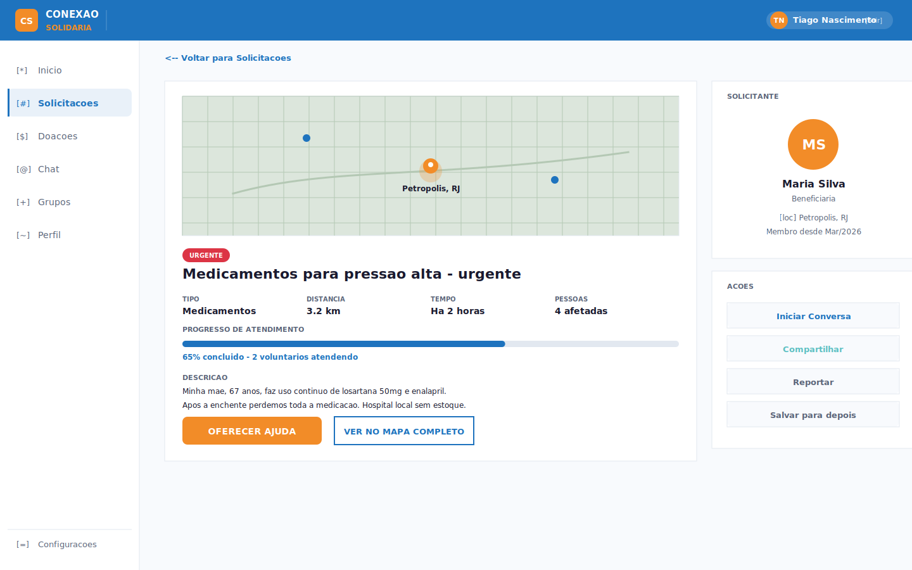
  <figcaption>Figura 33 – Detalhes das Solicitações.</figcaption>
</figure>

Página de detalhamento em layout de duas colunas. Coluna principal exibe **mapa de localização** no topo com pin laranja marcando o ponto exato, badge de urgência, título da solicitação e bloco de **metadados em quadrículas** (Tipo, Distância, Tempo, Pessoas afetadas). Apresenta **barra de progresso de atendimento**, descrição completa e dois CTAs principais: **"Oferecer Ajuda"** (laranja) e **"Ver no Mapa Completo"** (contorno azul). Coluna lateral com card do **Solicitante** (avatar, nome, tipo de perfil, localização, data de filiação) e card de **Ações secundárias** (Iniciar Conversa, Compartilhar, Reportar, Salvar).

#### Tela 07 — Nova Solicitação (RF05, RF08)

<figure>
  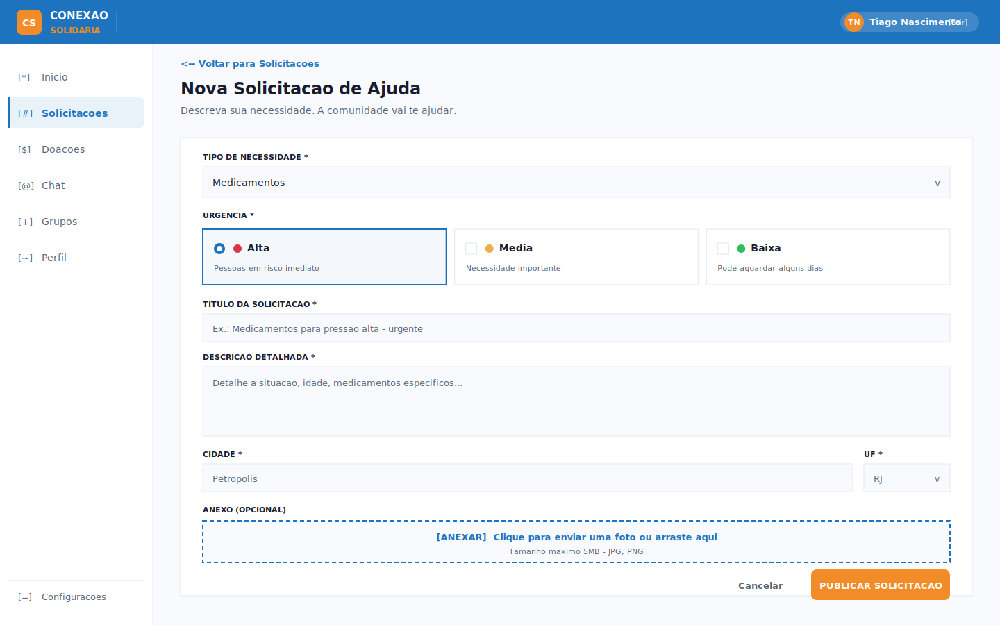
  <figcaption>Figura 34 – Nova Solicitação.</figcaption>
</figure>

Formulário completo para registro de novas solicitações de ajuda. Estrutura sequencial com **dropdown de Tipo de Necessidade**, **três cards radio para Urgência** (Alta/Média/Baixa) cada um com sua cor semântica e descrição auxiliar — o card selecionado destacado com borda azul de 2 px. **Campo de Título**, **textarea de Descrição Detalhada**, **Cidade e UF** lado a lado, e **dropzone de Anexo** com borda tracejada azul. Rodapé com botões **"Cancelar"** (link discreto) e **"Publicar Solicitação"** (laranja).

#### Tela 08 — Meu Perfil (RF13)

<figure>
  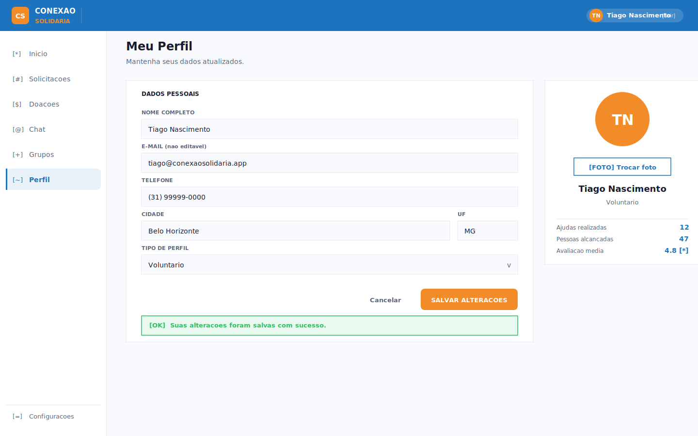
  <figcaption>Figura 35 – Perfil.</figcaption>
</figure>

Tela de gestão dos dados do usuário em duas colunas. Coluna lateral (320 px) com **avatar grande circular**, botão **"Trocar foto"**, nome do usuário em destaque, tipo de perfil ("Voluntário"), divisor e seção de **estatísticas pessoais** com três métricas: ajudas realizadas, pessoas alcançadas e avaliação média. Coluna principal contém formulário de edição com campos de **nome completo**, **e-mail** (somente leitura, com cadeado), **telefone**, **cidade + UF** lado a lado e **tipo de perfil** (dropdown). Banner verde de feedback de sucesso aparece após salvamento.

#### Tela 10 — Como Ajudar

<figure>
  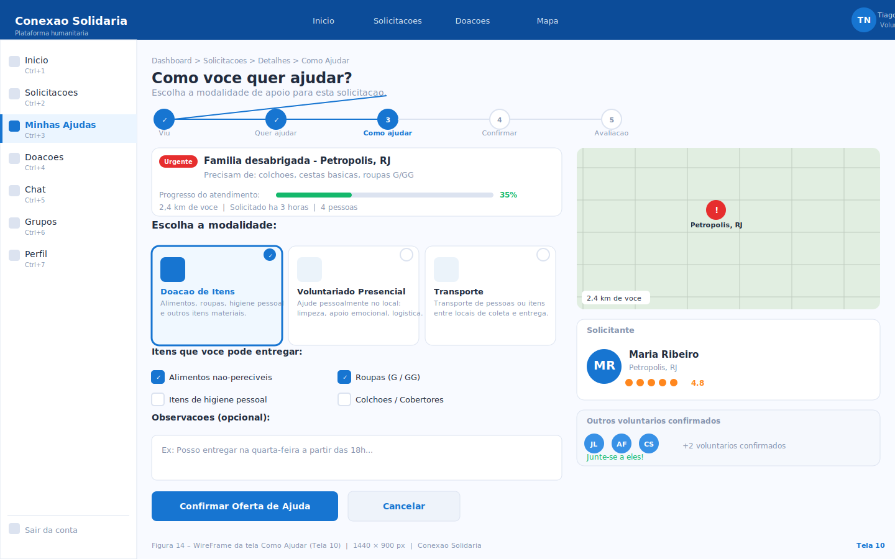
  <figcaption>Figura 36 – Detalhes Ajuda.</figcaption>
</figure>

Tela de seleção da modalidade de apoio. Layout em duas colunas: à esquerda, **três cards verticais** representando as opções (**Doação de Itens**, **Voluntariado Presencial**, **Transporte**), cada um com ícone circular colorido, título, subtítulo, descrição e radio button — a opção selecionada destacada com borda da cor da modalidade. À direita, **card lateral com mapa** mostrando proximidade entre o usuário e a solicitação, distância em km e tempo estimado de deslocamento. CTA principal: **"Confirmar minha oferta de ajuda"** (laranja, largura total).

#### Tela 15 — Ajuda Confirmada

<figure>
  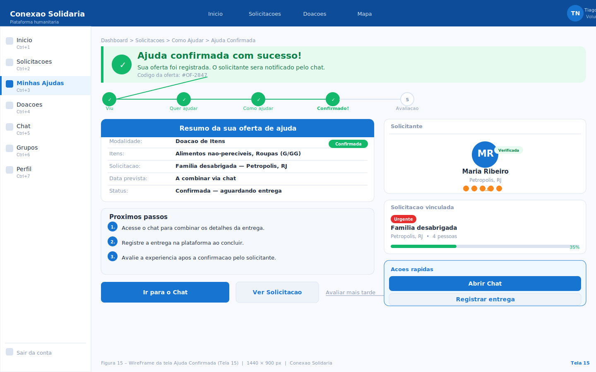
  <figcaption>Figura 37 – Confirmação da Ajuda.</figcaption>
</figure>

Tela de feedback de combinação bem-sucedida. Card centralizado com grande **ícone circular de check em verde** no topo, seguido de título **"Ajuda Confirmada!"** e mensagem de confirmação. Bloco de detalhes da combinação com avatares e identificação do **Solicitante** e do **Voluntário** lado a lado conectados por seta dupla, seguidos pelos detalhes da ajuda (item, local, horário). Três CTAs no rodapé: **"Ir para o Chat"** (laranja), **"Ver Detalhes"** (contorno azul) e **"Avaliar Depois"** (link discreto).

#### Tela 16 — Avaliação

<figure>
  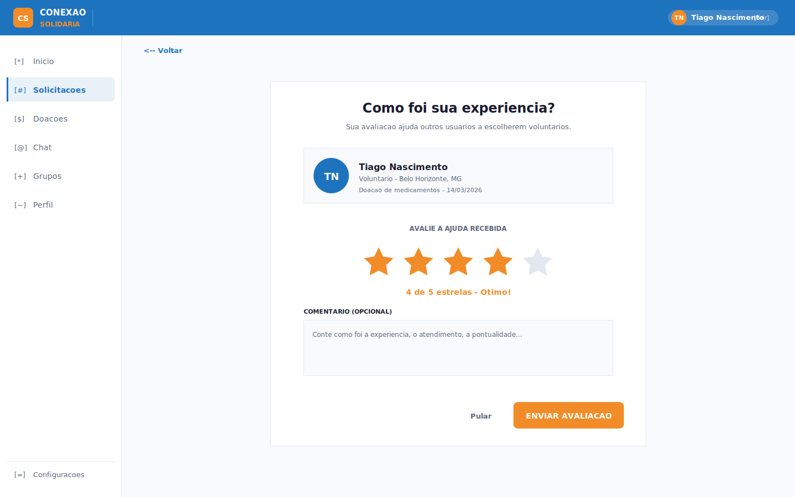
  <figcaption>Figura 38 – Avaliação.</figcaption>
</figure>

Card centralizado para registro de avaliação. Apresenta título **"Como foi sua experiência?"**, subtítulo explicativo e card do **voluntário avaliado** com avatar, nome, tipo de perfil e referência da ajuda concluída. Em seguida, **5 estrelas grandes em laranja** dispostas horizontalmente para seleção da nota (com 4 preenchidas no exemplo) e legenda dinâmica abaixo ("4 de 5 estrelas - Ótimo!"). Campo **"Comentário (opcional)"** com textarea para feedback livre. Botões **"Pular"** (link) e **"Enviar Avaliação"** (laranja).

#### Tela 17 — Confirmação de Entrega

<figure>
  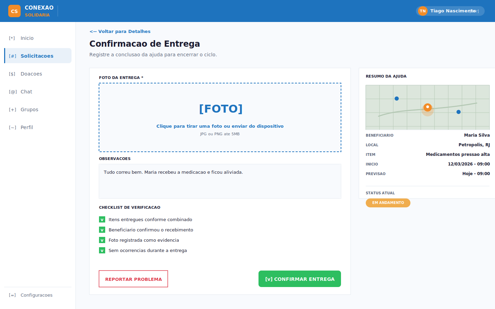
  <figcaption>Figura 39 – Confirmação da Entrega.</figcaption>
</figure>

Tela de encerramento do ciclo de ajuda em layout de duas colunas. Coluna principal contém **dropzone de foto da entrega** (com borda tracejada azul, indicando upload obrigatório), campo de **observações**, **checklist de verificação** com 4 itens marcáveis (itens entregues, recebimento confirmado, foto registrada, sem ocorrências) e dois CTAs: **"Reportar Problema"** (contorno vermelho) e **"Confirmar Entrega"** (verde de sucesso). Coluna lateral com **mapa pequeno** marcando o local de entrega, **resumo da ajuda** (beneficiário, local, item, horários) e **status atual** com badge de "Em Andamento".

### 3.3 Fluxo de Chat e Mensagens

#### Tela 09a — Chat — Lista de Conversas

<figure>
  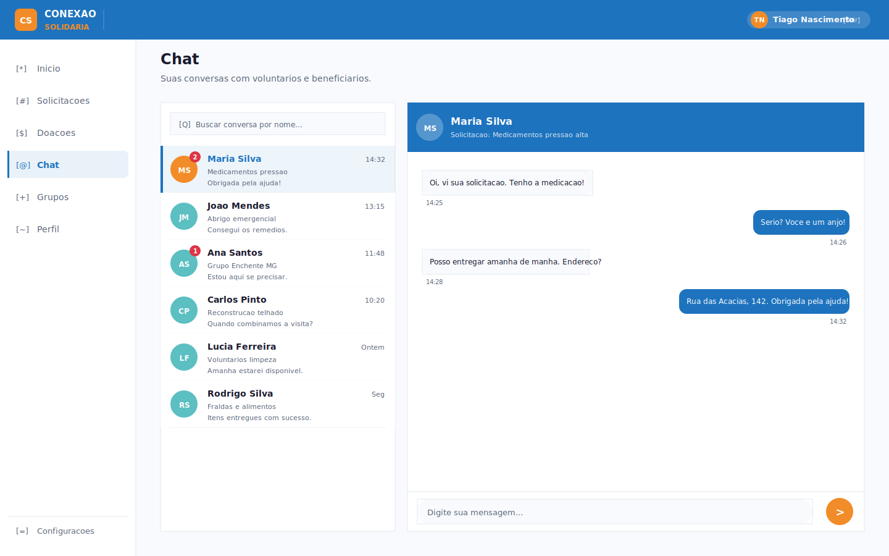
  <figcaption>Figura 40 – Chat.</figcaption>
</figure>


Layout em **painel dividido** (380 px de lista + área de preview). À esquerda, **barra de busca** no topo seguida pela lista de conversas, cada uma exibindo avatar circular do contato, nome, assunto da solicitação relacionada, prévia da última mensagem, timestamp e **badge laranja com número de mensagens não lidas**. A conversa ativa é destacada com fundo azul-claro e borda esquerda azul de 4 px. À direita, **painel de preview** com header azul exibindo a conversa selecionada, mensagens em bolhas (azul para próprio usuário, branca para o outro) e campo de entrada na parte inferior com botão de envio circular laranja.

#### Tela 09b — Chat — Conversa Individual

<figure>
  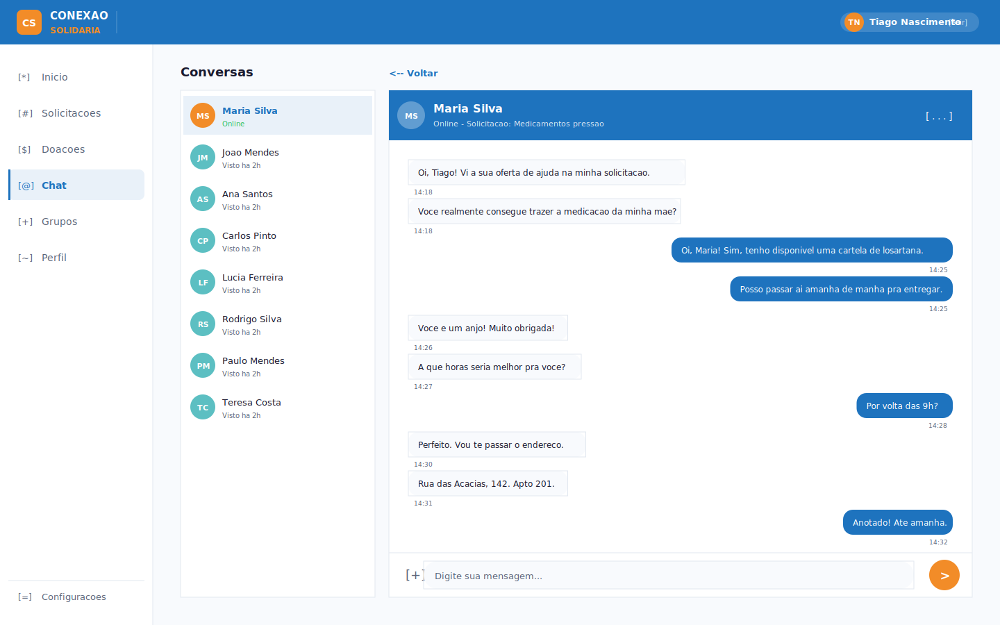
  <figcaption>Figura 41 – Conversa no Chat.</figcaption>
</figure>

Layout em **duas colunas no desktop**: à esquerda lista compacta de contatos (280 px) com avatares, nomes e indicador de status online (ponto verde) ou último visto; à direita a área principal de conversa ocupa todo o espaço disponível. Header da conversa em azul com avatar, nome, status ("Online") e referência à solicitação. Histórico de mensagens com **bolhas diferenciadas por remetente** (próprio usuário em azul à direita, outro em branco com borda à esquerda) e timestamps abaixo. Campo de entrada de texto na parte inferior com botão de anexo (esquerda), input arredondado e botão circular de envio (laranja).

### 3.4 Fluxo de Grupos Solidários

#### Tela 09c — Grupos

<figure>
  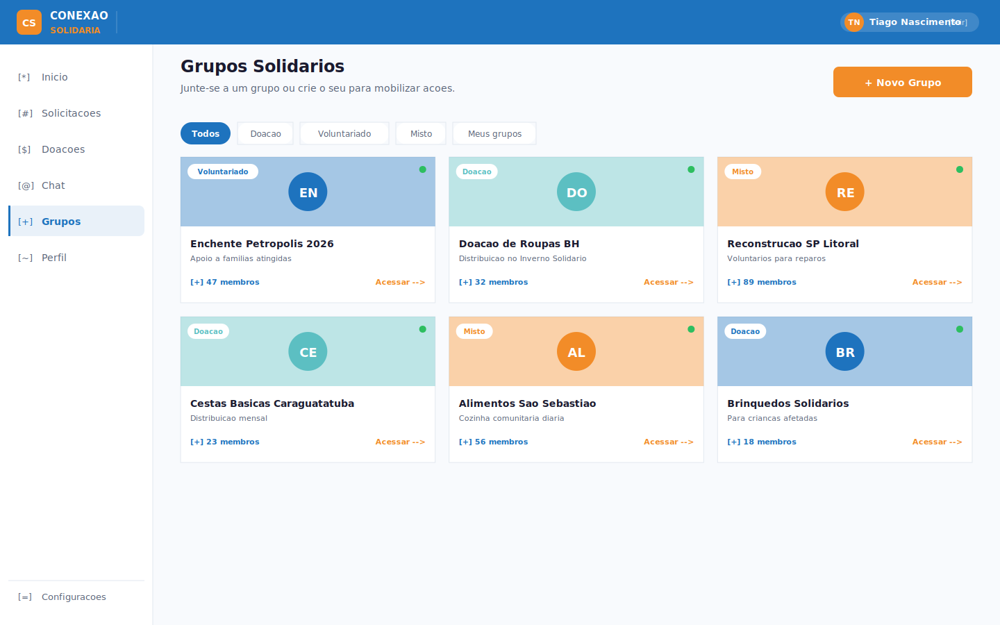
  <figcaption>Figura 42 – Grupos no Chat.</figcaption>
</figure>

Página principal do menu Grupos. Cabeçalho com título **"Grupos Solidários"** e CTA de destaque **"+ Novo Grupo"** (laranja). Linha de **chips de filtro** (Todos, Doação, Voluntariado, Misto, Meus grupos). Em seguida, **grid de 3 colunas** de cards de grupos, cada card contendo cover colorido com avatar do grupo no centro, **tag de tipo de atividade** (canto superior esquerdo), **indicador de atividade recente** (ponto verde no canto superior direito), nome do grupo, descrição curta, contagem de membros e link **"Acessar →"** em laranja.

#### Tela 11 — Criar Grupo

<figure>
  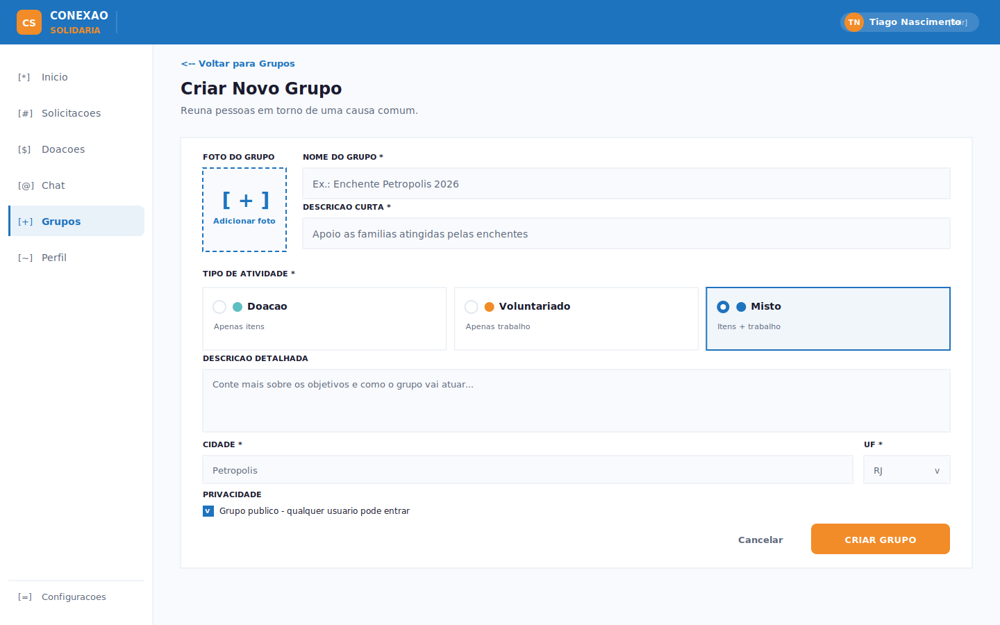
  <figcaption>Figura 43 – Criar grupos no Chat.</figcaption>
</figure>

Formulário para criação de novo grupo. Topo com **upload de foto do grupo** (placeholder tracejado de 120×120 px à esquerda) e campos de **nome do grupo** e **descrição curta** ao lado. Em seguida, seção **"Tipo de Atividade"** com três cards radio coloridos (Doação, Voluntariado, Misto), cada um com radio button, indicador colorido, título e subtítulo — opção selecionada destacada com borda da cor correspondente. **Textarea de Descrição Detalhada**, campos de **Cidade e UF** lado a lado, checkbox de **Privacidade** (grupo público) e CTAs **"Cancelar"** e **"Criar Grupo"** (laranja).

#### Tela 12 — Detalhes do Grupo

<figure>
  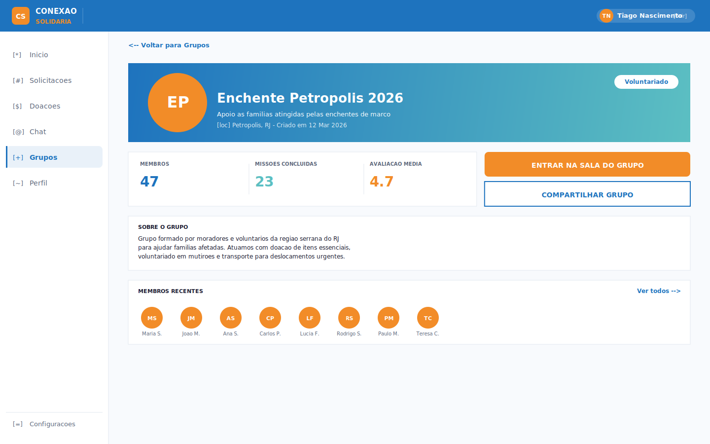
  <figcaption>Figura 44 – Detalhes dos grupos.</figcaption>
</figure>

Tela de visualização do grupo com **cover horizontal** em gradiente azul-turquesa exibindo avatar grande do grupo (60 px), nome, descrição, localização, data de criação e tag de tipo de atividade no canto direito. Abaixo, em layout de duas colunas: à esquerda card de **estatísticas do grupo** (Membros, Missões Concluídas, Avaliação Média) e à direita dois CTAs verticais (**"Entrar na Sala do Grupo"** em laranja e **"Compartilhar Grupo"** com contorno azul). Em seguida, card **"Sobre o Grupo"** com descrição completa e card **"Membros Recentes"** com avatares circulares dos 8 membros mais recentes em linha, cada um com nome abaixo.

#### Tela 13 — Sala do Grupo

<figure>
  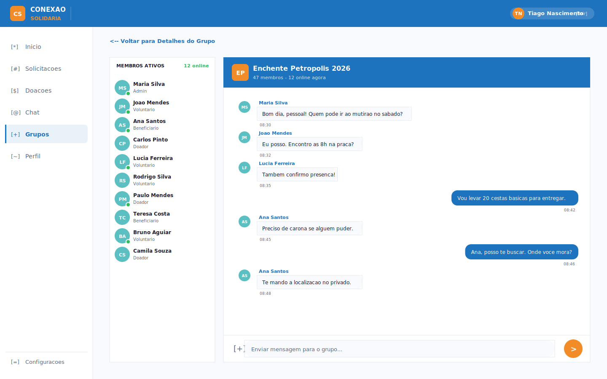
  <figcaption>Figura 45 – Sala dos grupos.</figcaption>
</figure>

Chat coletivo do grupo em **layout de duas colunas no desktop**. À esquerda (250 px) painel **"Membros Ativos"** com contador de pessoas online e lista de até 10 membros, cada um com avatar, nome, papel no grupo (Admin, Voluntário, Beneficiário, Doador) e indicador de presença online (ponto verde com borda branca). À direita, sala de chat com header azul exibindo o nome do grupo e contagem de membros/online. Mensagens em bolhas com **nome do remetente em destaque azul acima de cada bolha de outros usuários** e bolhas próprias em azul à direita. Campo de entrada com botão de anexo e botão de envio circular laranja.

#### Tela 14 — Compartilhar Grupo

<figure>
  
  <figcaption>Figura 46 – Compartilhar Grupo.</figcaption>
</figure>

Tela de convite com layout em duas colunas. À esquerda, **card centralizado com QR Code** estilizado do grupo (incluindo avatar do grupo no centro do código) e botão **"Baixar Imagem do QR"**. À direita, dois cards empilhados: **"Link do Grupo"** com URL copiável em campo de texto e botão azul **"Copiar"**, seguido de **"Compartilhar Diretamente"** com lista de quatro opções de redes sociais (WhatsApp, Telegram, Facebook, LinkedIn), cada uma com ícone circular colorido, nome do app, descrição da ação e link **"Compartilhar →"**.

---

## 4. Localização dos Artefatos no Repositório

| Arquivo | Função |
|---------|--------|
| `docs/06-Template Padrao da Aplicacao.md` | Este documento |
| `docs/img/wireframes-hifi/wf-*.png` | 19 wireframes hi-fi desktop (1440 × 900) |
| `docs/04-Projeto de Interface.md` | Documento original com fluxos e wireframes lo-fi |
| `src/wwwroot/css/site.css` | Folha de estilo única com toda a identidade visual |
| `src/Pages/Shared/_Layout.cshtml` | Layout mestre das telas autenticadas |
| `src/Pages/Shared/_LayoutPublic.cshtml` | Layout mestre das telas públicas |
| `src/Pages/_ViewStart.cshtml` | Define `_Layout` como layout padrão |
| `src/Pages/_ViewImports.cshtml` | Importa namespaces e tag helpers globalmente |

---

## 5. Mapeamento entre Telas, Fluxos e Requisitos

| Fluxo | Tela | Nome | Requisitos atendidos |
|-------|------|------|---------------------|
| Autenticação | 01 | Tela Inicial | (porta de entrada) |
| Autenticação | 02 | Login | RF02 |
| Autenticação | 03 | Criar Conta | RF01 |
| Autenticação | 04 | Dashboard | RF06 (visão agregada) |
| Solicitação & Ajuda | 05 | Lista de Solicitações | RF06, RF08 |
| Solicitação & Ajuda | 06 | Detalhes da Solicitação | RF06, RF08 |
| Solicitação & Ajuda | 07 | Nova Solicitação | RF05, RF08 |
| Solicitação & Ajuda | 08 | Meu Perfil | RF13 |
| Solicitação & Ajuda | 10 | Como Ajudar | RF07, RF09 |
| Solicitação & Ajuda | 15 | Ajuda Confirmada | RF09, RF10 |
| Solicitação & Ajuda | 16 | Avaliação | RF11 |
| Solicitação & Ajuda | 17 | Confirmação de Entrega | RF09 |
| Chat | 09a | Chat — Lista de Conversas | (comunicação) |
| Chat | 09b | Chat — Conversa Individual | (comunicação) |
| Grupos | 09c | Grupos | (organização coletiva) |
| Grupos | 11 | Criar Grupo | (organização coletiva) |
| Grupos | 12 | Detalhes do Grupo | (organização coletiva) |
| Grupos | 13 | Sala do Grupo | (comunicação coletiva) |
| Grupos | 14 | Compartilhar Grupo | (captação de membros) |

> **Observação:** as telas implementadas na Prova de Conceito (Etapa 2) correspondem ao subconjunto **01, 02, 03, 04, 05, 06, 07, 08**. As telas **09a a 17** estão projetadas para iterações posteriores do desenvolvimento.

---

## 6. Considerações sobre a Renderização dos Wireframes

Os 19 wireframes foram gerados programaticamente em **Python + pycairo**, garantindo precisão pixel-a-pixel das proporções, cores e espaçamentos definidos neste documento. Algumas observações sobre interpretação visual:

- **Ícones de navegação** são representados nos wireframes com placeholders textuais entre colchetes (ex.: `[*]`, `[#]`, `[$]`) por limitação técnica de renderização de emojis no ambiente de geração. Na implementação real (HTML/CSS), os emojis Unicode definidos na seção 1.3 são renderizados normalmente pelo navegador.
- **Mapas** são representados por placeholder estilizado (grid + linhas curvas + pin laranja). Na implementação real, podem ser substituídos por integração com Google Maps, Leaflet ou Mapbox.
- **QR Code** da Tela 14 é uma matriz visual ilustrativa — na implementação real deve ser gerado dinamicamente pela biblioteca apropriada (ex.: `QRCoder` no .NET) com o link real do grupo.
- **Avatares** mostrados nos wireframes usam iniciais sobre fundo colorido. Na implementação real, podem ser substituídos pela foto de perfil do usuário quando disponível, mantendo o fallback de iniciais para usuários sem foto.

<!--
<span style="color:red">Pré-requisitos: <a href="2-Especificação do Projeto.md"> Especificação do Projeto</a></span>, <a href="3-Projeto de Interface.md"> Projeto de Interface</a>, <a href="4-Metodologia.md"> Metodologia</a>

Layout padrão da aplicação que será utilizado em todas as páginas com a definição de identidade visual, aspectos de responsividade e iconografia.

> **Links Úteis**:
>
> - [CSS Website Layout (W3Schools)](https://www.w3schools.com/css/css_website_layout.asp)
> - [Website Page Layouts](http://www.cellbiol.com/bioinformatics_web_development/chapter-3-your-first-web-page-learning-html-and-css/website-page-layouts/)
> - [Perfect Liquid Layout](https://matthewjamestaylor.com/perfect-liquid-layouts)
> - [How and Why Icons Improve Your Web Design](https://usabilla.com/blog/how-and-why-icons-improve-you-web-design/)
-->