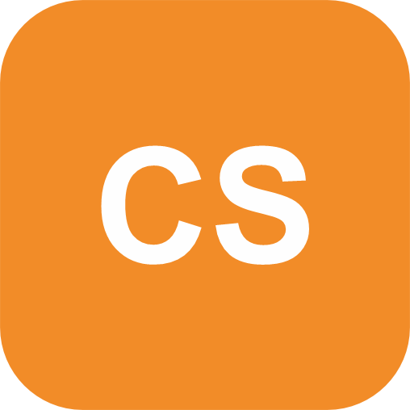

# Apresentação

## Título do Projeto

Conexão Solidária

## Identidade Visual (Marca, Design)

### Cores primárias

As cores primárias foram escolhidas em tons de azul para transmitir confiança, segurança e solidariedade — valores centrais da plataforma.

| Cor | Hex | Uso |
|---|---|---|
| Azul Principal | `#1E73BE` | Sidebar, botões primários, destaques |
| Azul Escuro | `#155A99` | Hover, estados ativos |
| Verde | `#2DBE60` | Indicadores de sucesso, badges positivos |

### Cores secundárias

As cores secundárias complementam a paleta com calor e neutralidade, tornando a interface acolhedora e fácil de usar.

| Cor | Hex | Uso |
|---|---|---|
| Laranja Acento | `#F28C28` | Botões de ação, logo, urgência média |
| Teal | `#5CBFC2` | Gradiente de fundo nas telas públicas |
| Vermelho | `#DC3545` | Alertas de urgência alta |
| Cinza Texto | `#5A6478` | Textos secundários e metadados |
| Fundo | `#F8FAFD` | Background geral da aplicação |

### Tipografia

A tipografia utilizada segue o stack do sistema operacional: `-apple-system`, `Segoe UI`, `Roboto`, `Helvetica`, `Arial`. Essa escolha garante leitura confortável e carregamento sem dependências externas de fonte.

## Logo

O logotipo da Conexão Solidária é composto por um ícone de mãos unidas sobre um fundo laranja (`#F28C28`), acompanhado do nome da plataforma em letras maiúsculas com o acento laranja na palavra "SOLIDÁRIA".

## Conjunto de Slides (Estrutura)

[Acesse a apresentação clicando aqui.](https://github.com/ICEI-PUC-Minas-PMV-ADS/pmv-ads-2026-1-e2-proj-int-t6-conexao-solidaria/blob/main/presentation/Conexao_Solidaria.pdf)

## Apresentação da Solução

## Vídeo de apresentação - Etapa 01

https://private-user-images.githubusercontent.com/232954358/559960394-9fa31f02-c4c6-4696-a892-d6464b550bfa.mp4?jwt=eyJ0eXAiOiJKV1QiLCJhbGciOiJIUzI1NiJ9.eyJpc3MiOiJnaXRodWIuY29tIiwiYXVkIjoicmF3LmdpdGh1YnVzZXJjb250ZW50LmNvbSIsImtleSI6ImtleTUiLCJleHAiOjE3NzMwMDEzODYsIm5iZiI6MTc3MzAwMTA4NiwicGF0aCI6Ii8yMzI5NTQzNTgvNTU5OTYwMzk0LTlmYTMxZjAyLWM0YzYtNDY5Ni1hODkyLWQ2NDY0YjU1MGJmYS5tcDQ_WC1BbXotQWxnb3JpdGhtPUFXUzQtSE1BQy1TSEEyNTYmWC1BbXotQ3JlZGVudGlhbD1BS0lBVkNPRFlMU0E1M1BRSzRaQSUyRjIwMjYwMzA4JTJGdXMtZWFzdC0xJTJGczMlMkZhd3M0X3JlcXVlc3QmWC1BbXotRGF0ZT0yMDI2MDMwOFQyMDE4MDZaJlgtQW16LUV4cGlyZXM9MzAwJlgtQW16LVNpZ25hdHVyZT01NmUwNGRhMzNiYjNjYTg5NzljY2M0ZjQzOTc5MGE1NDAzYTY2ZTBjN2IzMWQ1ZmRiNTA4NjNmNWQwZTRjNjg4JlgtQW16LVNpZ25lZEhlYWRlcnM9aG9zdCJ9.jVjgbvRZg6eYtQ9uovrc4BeOX4RY3BKIJKgHd3FhZM0

## Vídeo de apresentação - Etapa 05

https://private-user-images.githubusercontent.com/232954358/610958632-64540336-9e29-4500-b2ca-1b13fa7164b5.mp4?jwt=eyJ0eXAiOiJKV1QiLCJhbGciOiJIUzI1NiJ9.eyJpc3MiOiJnaXRodWIuY29tIiwiYXVkIjoicmF3LmdpdGh1YnVzZXJjb250ZW50LmNvbSIsImtleSI6ImtleTUiLCJleHAiOjE3ODIwOTgzMDgsIm5iZiI6MTc4MjA5ODAwOCwicGF0aCI6Ii8yMzI5NTQzNTgvNjEwOTU4NjMyLTY0NTQwMzM2LTllMjktNDUwMC1iMmNhLTFiMTNmYTcxNjRiNS5tcDQ_WC1BbXotQWxnb3JpdGhtPUFXUzQtSE1BQy1TSEEyNTYmWC1BbXotQ3JlZGVudGlhbD1BS0lBVkNPRFlMU0E1M1BRSzRaQSUyRjIwMjYwNjIyJTJGdXMtZWFzdC0xJTJGczMlMkZhd3M0X3JlcXVlc3QmWC1BbXotRGF0ZT0yMDI2MDYyMlQwMzEzMjhaJlgtQW16LUV4cGlyZXM9MzAwJlgtQW16LVNpZ25hdHVyZT0zN2RlZTYxY2RmNGM3MmI4NTA0YzlkMTg0NjgwZDY5Yjk2YjNlZjA0NjlhMWE5NDAxNzIyZDFjMDM2MWRkYmE5JlgtQW16LVNpZ25lZEhlYWRlcnM9aG9zdCZyZXNwb25zZS1jb250ZW50LXR5cGU9dmlkZW8lMkZtcDQifQ.3yVUa-qnN7CNas_lk-fG8Xg2ytpZu9LkcCSrf0HZggk
